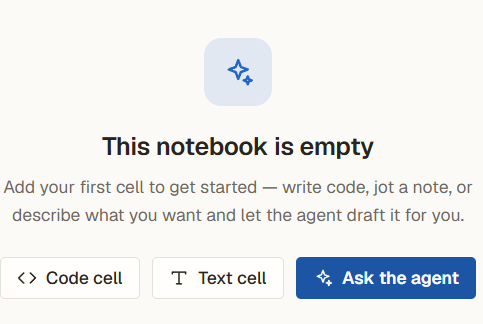
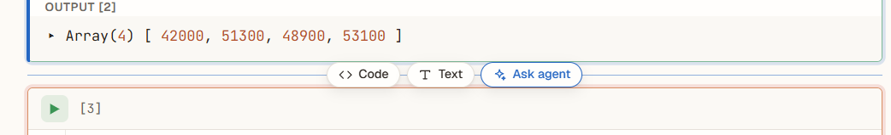
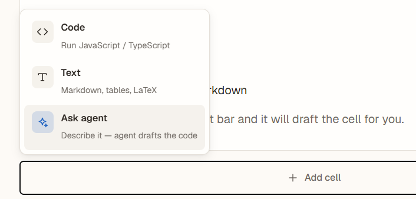
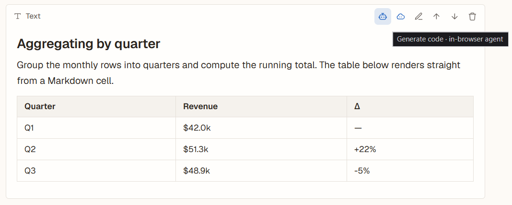
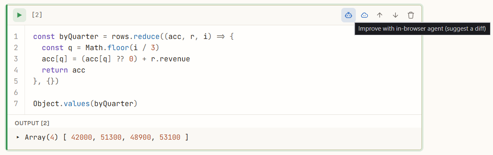
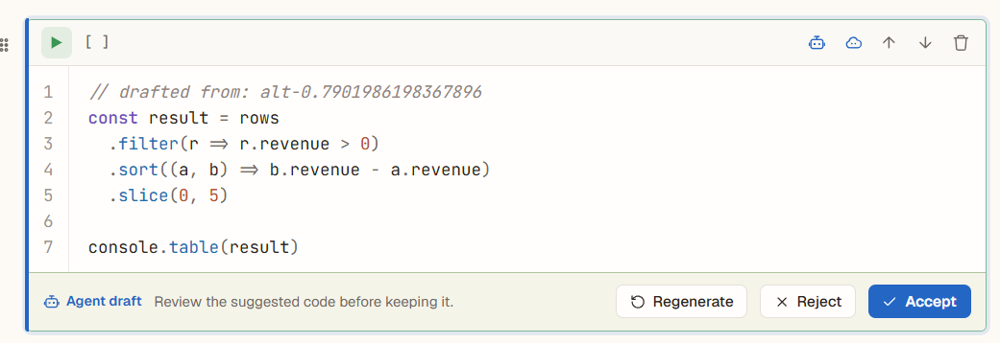

# AI Architecture — JS Notebook code generation pipeline

> An architecture decision for the AI code-generation pipeline (Epic 07).
> Resolves the **Tech Lead — Design AI Generation Pipeline** task (issue #112).
>
> Source-of-truth order follows `AGENTS.md` §12.
> This document reconciles drift across `System_Architecture.md` §4.3, `requirements.md` §3, and `qa-plan.md` §6.6, and is forward-compatible with the design proposal AI-UX (issue #74, UX Polish).

---

## 1. Overview

JS Notebook turns a plain-language prompt into runnable JavaScript/TypeScript — the project's headline feature (Epic 07).
This document designs the full generation pipeline: where the model runs, the prompt-cell schema, the AI Service API, the current JSON REST transport plus target streaming contract, provider integration (AWS Bedrock + WebLLM), the validation/repair loop, and error handling.

The pipeline is **hybrid**: a request is served either by an in-browser model or by a backend proxy, and both paths return code in a unified shape so the UI does not depend on where generation happened.
This mirrors the hybrid model already used for code *execution* (`execution-architecture.md`) — same philosophy, a different workload.

This is a design document.
It **proposes** the `POST /api/v1/llm/generate` endpoint and its contract; the endpoint is implemented by the Epic 07 engineering tasks (notably #117 for validation), not by this document.

---

## 2. Execution strategy — where the AI runs

**Decision: a hybrid, two-tier pipeline with an explicit user choice in the MVP.**

| Tier | Where | UI label | Role |
|---|---|---|---|
| **T1** | In-browser (WebLLM on WebGPU) | **In-browser agent** | Local, no network, no API cost. Default for capable clients. |
| **T2** | Backend proxy → AWS Bedrock | **Cloud agent** | Server-side, hides keys, handles heavy/long prompts. |

Order of preference is **T1 → T2**.
Both tiers are user-selectable in the MVP (two buttons, below).

> **A third external-provider tier is out of scope.**
> A previous draft of this document included a `T3 → OpenAI` fallback behind the backend proxy.
> It is **removed from the MVP** — the educational scope can't justify the cost-control surface (per-user daily quotas, global ceilings, alerting) a paid third-party fallback requires.
> External-provider fallback is recorded as a **far-future** option in §9 and is not implemented anywhere in this document.

> **Current sprint scope (MVP).**
> Generation is triggered by **two explicit buttons** — *In-browser agent* and *Cloud agent* (Meeting 4, 2026-06-03).
> There is **no silent auto-routing** yet: the user picks the path, which lets the team test and compare T1 vs T2 independently.
> A single "smart" button that auto-routes (e.g. by prompt size or client capability) and dynamic runtime memory profiling are **target/future** — collapsing the two buttons into one re-votes the Meeting 4 decision and is out of scope here.

Even with a manual choice, the *In-browser agent* button is **gated by client capability** (§3) so that a weak client cannot pick a path that freezes the tab.
This gating is **sprint scope**, not future.

The issue (#112) sketches a `< 200 chars → browser, else → backend` heuristic.
That heuristic is recorded as a **future** auto-routing input, not an MVP behaviour; the MVP routing decision is made by the user via the two buttons, constrained by capability gating.

### 2.1 Current front-end wiring

The shipped Epic 07 UI currently exposes the hybrid pipeline through three
surfaces:

- **Notebook markdown/text cell toolbar.** The user can run the same cell prompt
  through the *In-browser agent* or the *Cloud agent*. The in-browser path uses
  the front-end Context Builder (§4.3.1) and prepends the rendered context block
  to the local model prompt. The Cloud path calls `POST /api/v1/llm/generate`
  and inserts the returned `code` response as a code cell or `text` response as
  a markdown cell (§4.4).
- **Ask-agent dialog.** The notebook insert strip can open a popup that asks for
  a one-off prompt and inserts the answer after the chosen cell. The dialog has
  separate Cloud and In-browser actions, mirroring the toolbar. In the current
  MVP this dialog sends the prompt itself; it does not yet include notebook
  context.
- **LLM Playground.** The playground is a comparison/debug surface. It sends one
  shared user message to the local WebLLM panel and the Cloud panel at the same
  time, then renders the answers side-by-side. It is not a notebook generation
  surface and does not send notebook context.

### 2.2 Terminology — issue tools, canonical tiers, UI labels

The issue names the tools "AWS Bedrock" and "WebLLM"; the existing docs describe a "WASM → backend → OpenAI" chain; the design proposal labels the buttons "In-browser" / "Cloud".
These map onto two MVP tiers:

| Issue #112 | `qa-plan.md` §6.6 | Design proposal UI | This doc |
|---|---|---|---|
| WebLLM (browser) | WASM LLM | In-browser agent | **T1** |
| AWS Bedrock (backend) | Backend LLM | Cloud agent | **T2** |
| OpenAI API | OpenAI API | — | not in MVP (§9 far-future) |

"WebLLM" is the concrete browser-inference library filling the same slot that `execution-architecture.md` calls "Frontend WASM".
"AWS Bedrock" is the managed gateway behind the backend proxy (§6), not a parallel chain.
The `qa-plan.md` row for "OpenAI API" reflects a previous draft; the qa-plan is brought in line in the same PR (§6.3).

---

## 3. Client capability detection

The MVP gives the user two buttons, but the *In-browser agent* button must not be a foot-gun.
WebLLM downloads a multi-hundred-MB model and runs inference on the client; on a weak machine that freezes the tab.
So the browser button is **gated** by a capability check before it is offered as enabled.
This gating is **sprint scope** — without it, two raw buttons ship a notebook that hangs on low-end clients.

Gating keeps the two-button model intact: the button is simply `disabled` with an explanatory tooltip when the client can't run WebLLM, and the user falls back to *Cloud agent*.

### 3.1 Signals (in priority order)

| # | Signal | Source | Rule |
|---|---|---|---|
| 1 | **WebGPU available** | `navigator.gpu` (+ `requestAdapter()`) | No WebGPU → browser button disabled. **Primary gate.** |
| 2 | **Device memory** | `navigator.deviceMemory` | `≤ 4 GB` → don't offer the browser button (coarse, Chromium-only, bucketed). |
| 3 | **Prompt length** | prompt char count | Long prompt → steer to *Cloud agent* (heavier local inference). |

**WebGPU is the primary signal, not WASM.**
WebLLM runs on **WebGPU**, not on plain WebAssembly.
Without a WebGPU adapter the in-browser tier cannot start regardless of how much RAM the client has.
This corrects `qa-plan.md` §6.6 **L-10** ("the browser does not support WASM"): the real gate is "no WebGPU", and the documented fallback (to the Cloud agent) is the right behaviour for that case.

`navigator.deviceMemory` is a coarse, bucketed hint (0.25..8 GB) available only on Chromium.
It is a secondary heuristic, never a hard guarantee.
Exact runtime probing via `measureUserAgentSpecificMemory()` (requires COOP/COEP isolation, async, Chromium-only) is **future** and not relied on for the MVP gate.

### 3.2 Graceful fallback on T1 failure

Capability detection is best-effort; it cannot predict every failure.
If the in-browser model fails to initialise, runs out of memory, or throws mid-generation, the path **falls back to the Cloud agent (T2)** rather than surfacing a raw error.
The fallback is shown to the user (a small notice), consistent with the per-tier UX policy in §8.

This makes the gate a *filter*, not a *promise*: it removes the obviously-incapable clients up front, and the runtime fallback covers the rest.

---

## 4. Prompt Cell schema and context

### 4.1 The Prompt Cell is the first-class `ai` cell

The design proposal notebook (issue #74, UX Polish) introduces a first-class **`ai` cell** — it sits alongside `code` and `markdown` in the cell dispatcher.
This `ai` cell **is** the "Prompt Cell" the issue asks the Tech Lead to schematise.

The UI offers **six** places to start an LLM request (design proposal, UX Polish).
Listing them is a UX concern; the architecture must stay invariant to *how many* buttons exist, so the table below is descriptive, and the contract collapses them all (§4.1.1).

**Every touchpoint exposes two buttons — *In-browser agent* and *Cloud agent*** — so the user picks the tier (T1 / T2) at the point of the request.
The only exception is **Regenerate** (on the proposal bar), which re-runs the **same agent that produced the draft**, so it needs no second button.

| # | Touchpoint | Where it appears | Prompt source | Agent buttons                        |
|---|---|---|---|--------------------------------------|
| 1 | Empty-state "Ask the agent" | A blank notebook | new `ai` cell | Just action button to create AI-cell |
| 2 | Insert-strip "Ask agent" pill | Between any two cells | new `ai` cell | Just action button to create AI-cell |
| 3 | Add-cell picker "Ask agent" | The "Add cell" menu | new `ai` cell | Just action button to create AI-cell |
| 4 | `ai` cell action buttons | In the cell list | the `ai` cell's `prompt` | In-browser / Cloud                   |
| 5 | Text/markdown cell toolbar | A text cell's toolbar | the text cell's `source` | In-browser / Cloud                   |
| 6 | Code cell "improve" (agent-edit) | A code cell's toolbar | the existing code | In-browser / Cloud                   |
| — | Proposal-bar "Regenerate" | On a draft proposal | the original request | inherits the draft's agent           |

Touchpoints 1–3 first *create* an `ai` cell; the request itself fires from its two buttons (touchpoint 4).

**Touchpoint proposal screenshots**:

> *Screenshots are taken from the current design proposal (issue #74, UX Polish).*
> *The design is **not** yet finalised — the final screens may differ from these images. The architectural contract in this document is what is committed; the exact UI surface is the UX Polish task's call.*

- Touchpoint 1 — empty-state "Ask the agent":
  
- Touchpoint 2 — insert-strip "Ask agent" pill:
  
- Touchpoint 3 — add-cell picker "Ask agent":
  
- Touchpoint 4 — `ai` cell with In-browser / Cloud buttons:
  
- Touchpoint 5 — text/markdown cell toolbar buttons:
  
- Touchpoint 6 — code cell "improve" (agent-edit):
  
- Regenerate — proposal bar (inherits the draft's agent):
  

The `ai` cell carries a single user field — the prompt text — plus the chosen agent (`local` / `cloud`).
It is a transient authoring surface: it produces a result cell (§4.4) and is not itself an execution unit.

#### 4.1.1 The invariant — six touchpoints, three axes

Every touchpoint reduces to a point on three axes, and the API contract (§5) is built on those axes, not on the buttons:

- **Prompt source** — an `ai` cell's `prompt` (1–4), a text cell's `source` (5), or existing code (6). Either way the wire payload is the same `prompt` string (§5.1).
- **Request mode** — `generate` (1–5, produce a new result cell) or `edit` (6, revise existing code as a diff). This is the `mode` field (§5.4).
- **Tier** — *In-browser agent* (T1) or *Cloud agent* (T2), chosen by which of the two buttons is clicked. Regenerate inherits the draft's tier instead of asking again.

A seventh or eighth touchpoint added at UX Polish costs **zero** contract change as long as it lands on these three axes.
This is why the document schematises the `ai` cell and the `{source, mode, tier}` axes rather than the button set.

```jsonc
// ai (Prompt) cell
{
  "id": "cell-uuid",
  "type": "ai",
  "prompt": "group rows by quarter and chart it",
  "agent": "local"            // "local" (In-browser) | "cloud" (Cloud)
}
```

**MVP vs. design proposal surface.**
Meeting 4 (2026-06-03) scoped the MVP to a simpler surface: a **markdown/text cell with two agent buttons**, where the prompt is the cell's own source text.
That is the *same* contract with a lighter UI — the request payload (§5) and the result lifecycle (§4.4) are identical whether the prompt comes from an `ai` cell or a text cell.
Which surface ships first is an **Epic 07 / UX-Polish front-end decision, not an architectural fork**; the schema and API below are built around the `ai` cell from the start so nothing breaks when it lands.
Persisting the `ai` cell type (IndexedDB, server sync) touches the **Epic 02** data model — flagged as a dependency, **not built by this document**.

### 4.2 Composing the request

Before calling any model, the prompt is combined with notebook context.
The target rule is **path-independent** context collection: the same notebook
context should be available whether the model is the In-browser or the Cloud
agent, so results are comparable (Meeting 4).

The current shipped UI is not fully unified yet:

| Surface | Current context behaviour |
|---|---|
| Notebook toolbar — In-browser agent | Uses the front-end Context Builder: cells above the prompt cell, globals digest, live output digests, byte/item caps (§4.3.1). The context is rendered into the local prompt text. |
| Notebook toolbar — Cloud agent | Sends a v1 backend payload context: `cells.slice(max(0, idx - 10), idx)`, old → new, mapped to `{ kind, source }`; code cells stay `code`, markdown/text cells are sent as `text`. It also sends `notebookTitle` when present. |
| Ask-agent dialog | Sends the prompt, `language: "javascript"`, and `mode: "generate"`; notebook context is not included yet. |
| LLM Playground | Sends the same user prompt to local and Cloud panels for side-by-side comparison; notebook context and notebook title are not included. |

The assembled payload (wire shape in §5) carries:

- the user **prompt** (the Prompt Cell's text);
- an ordered **context** slice of neighbouring cells;
- the **notebook title** and target **language** (`javascript` | `typescript`).

### 4.3 Context collection rules

Context lets the model see what already exists in the notebook's global scope (variables, helpers) so generated code fits in.
Rules (from `ui/docs/tasks/07-llm-code-generation.md`):

- **Window:** the last **N = 10** cells above the Prompt Cell, in order.
- **Per-cell content:** `{ kind, source }`. `kind ∈ code | markdown | text` is the verbatim cell source. Three extra kinds carry compact derived context, all in the same `source` string and byte budget:
  - `output` — a **truncated** digest of a cell's outputs (so the model sees real result shapes; large/raw outputs are capped).
  - `globals` — a compact **name/type/shape** digest of the notebook's declared globals (so the model reuses what exists instead of redeclaring). MVP builds it by **static analysis** of code cells (acorn); runtime introspection of exact values is a future enhancement.
  - `summary` — the budget-aware roll-up of older history (§4.3.1).
- **Size cap:** context slice **≤ 8 KB**; if larger, **truncate from the oldest** cell until it fits (the nearest cells matter most). The whole-request cap is 16 KB (§5.1); the context slice is the first thing trimmed when the assembled request is over budget. The backend re-validates these caps and returns `422` on an oversized request (§8.4) rather than silently truncating.
- **Opt-out:** honour `notebookSettings.llm.includeContext` (default `true`); when `false`, send the prompt with no context.
- **Total request cap:** the whole request body is capped (§5); context is the first thing trimmed when over budget.

**Current Cloud v1 note.** The notebook toolbar Cloud path already sends the
last 10 cells above the prompt cell, but it intentionally uses the smaller v1
shape listed in §4.2: source-only neighbour cells, no `globals`, no `output`, no
`summary`, and no persisted context mode. Bringing Cloud context to the full
Context Builder / persisted-context model is a follow-up, not part of the
shipped `ui#87` slice.

#### 4.3.1 Context Builder, persistence and roll-up (Epic 07 / #116)

The front-end **Context Builder** assembles the `{ kind, source }[]` slice from the cells above the Prompt Cell. There are **two modes**, switched by `VITE_AI_CONTEXT_MODE` (default `at-send`):

- **`at-send`** — build the context from the cells at the moment the user generates. Nothing is persisted; the request stays `{ prompt, context }`.
- **`persisted`** — the context is **stored server-side** and kept in sync. On entry the last saved context is loaded; each user action rebuilds it **asynchronously** in user-operation order; the send path **waits** for the in-flight build. Updates are **incremental** — only the cells a change touched are recomputed (not the whole notebook) — except a **delete**, which **clears and rebuilds** so stale context never lingers. If the load from the backend fails, the failure is **logged** and the send path **falls back to building context on the front-end**.

**Persistence (backend).** `GET/PUT/DELETE /api/v1/notebooks/{id}/ai-context` store the built context (owner-scoped, alongside the notebook). On `PUT`, a **pluggable, budget-aware summary service** rolls older history into a single `summary` item so the stored context always fits the 8 KB / 10-item generation budget. The strategy is selected by `LLM_CONTEXT_SUMMARY_STRATEGY`:

- `compact-oldest` (**default**) — a deterministic, model-free fold of the oldest cells (no network, no cost, no injection surface).
- `llm` — summarise the folded cells with Bedrock for a higher-quality digest. Adds token cost + latency on the `PUT` and is a prompt-injection surface (notebook content is sent to the model, so the summariser's system prompt frames it strictly as data); on **any** provider failure it **falls back to the deterministic digest**, so persistence never breaks.

**Settings.** The stored-history PUT body is bounded by the existing `LLM_MAX_PROMPT_BYTES` (no separate knob) and rejected with `422` when over. The summary service then rolls the stored history up to the 10-item generation budget on use.

> **Not in MVP context:** raw outputs and live runtime globals are out of scope as *separate* large payloads — only the **truncated `output`** and **static `globals` digest** above are sent. AI/prompt cells are not treated as context unless the team decides otherwise.

### 4.4 Result lifecycle — proposal, not auto-commit

Generation never silently mutates the notebook.
The result is inserted as a **separate new cell below the Prompt Cell**, and that cell goes through a proposal lifecycle, per the design proposal:

```
generating  →  proposal (new | edit)  →  accept | reject | regenerate
     |              |
     | cancel       | (no acceptance — e.g. user closes the tab)
     v              v
  idle draft     dropped
```

- **generating** — current MVP waits for the JSON response; target streaming appends tokens progressively (§5.3).
- **proposal** — generation completed; the cell is a *draft* awaiting the user.
- **accept** — the draft becomes a normal cell (code cells are still not executed — see §8).
- **reject** — a `new` draft is removed; an `edit` draft reverts to the original.
- **regenerate** — re-runs generation for a fresh draft, reusing the **same agent (tier)** that produced the current draft (no agent re-pick).
- **cancel (during generating)** — user explicit cancel (Esc / Cancel button): the partial draft is **kept** in an `idle`, user-editable state (§5.3). Distinct from a stream error/timeout, where the partial is discarded (§8.4).

**Persistence — MVP scope.**
A proposal is in-memory only.
If the user closes the tab between *streaming done* and *accept*, the draft is **dropped** — the user re-issues the request from the same Prompt Cell.
This is the simplest MVP behaviour and stays consistent with `qa-plan.md` L-08 ("incomplete result is not saved"); persisting proposal-state to IndexedDB requires extending the Epic 02 data model and is recorded as a far-future option (§9).

This strengthens the security posture (§8): generated code is **neither auto-run nor auto-committed**.
The Meeting 4 MVP keeps the source Prompt Cell in place after generation, so the prompt stays as a re-runnable record.

**Code result vs. text result.**
Not every prompt asks for code — a user may ask a plain question ("what does `reduce` do?") and want prose back (Meeting 4).
The result therefore carries a **`resultKind`** (§5.2):

- `resultKind: "code"` → the draft is a **code cell** (the path above; validation §7 applies).
- `resultKind: "text"` → the draft is a new **markdown/text cell**; code validation (§7) is **skipped** — there is nothing to syntax-check.

The proposal lifecycle (accept / reject / regenerate) is identical for both.

**MVP per-tier `resultKind` policy.**
T2 (Cloud) can return `resultKind: "code"` or `resultKind: "text"`.
The backend keeps `code` as the default and uses a conservative prompt heuristic for explicit explanation/prose requests; `edit` mode always remains `code`.
T1 (In-browser) remains code-only until the chosen WebLLM model can set `resultKind` reliably.
The UI inserts Cloud `text` responses as markdown cells and keeps Cloud `code` responses as code cells.

> `resultKind` (the answer type: `code` | `text`) is distinct from a context item's `kind` (the neighbour cell's type: `code` | `markdown`, §4.3).
> Different axes — named differently on purpose to avoid a same-field collision.

### 4.5 System prompt and hard rules

The system prompt and non-negotiable generation rules live in a dedicated, version-controlled file (an `AGENTS.md`-style file for the generator, per Meeting 4) rather than being inlined in code.
The baseline format follows `requirements.md` §3.3:

```
System:
  You are an assistant that writes clean JavaScript/TypeScript code.
  Return ONLY the code — no explanations, no markdown fences.
  The code must run in a browser sandbox (QuickJS), with no Node or Python APIs.

User:
  Notebook context (optional):
  [last N=10 cells, ≤ 8 KB]

  Task:
  [Prompt Cell text]
```

The "return only code" instruction is a *request*, not a guarantee — the validation pipeline (§7) defensively strips any markdown the model adds anyway.

---

## 5. AI Service API

The backend exposes a single proxy endpoint for the **Cloud agent** (T2).
The **In-browser agent** (T1) never calls it — it runs WebLLM locally and produces the same result shape in-process (§5.3).

```
POST /api/v1/llm/generate
```

Versioned under `/api/v1` to match the rest of the API.
This endpoint is **proposed here and implemented by Epic 07**; when it lands, the OpenAPI snapshot is regenerated (`scripts/openapi.py dump`) and `api/docs/openapi.json` is committed with it.

### 5.1 Request

```jsonc
{
  "prompt": "string",            // required; the Prompt Cell text, length-capped server-side
  "mode": "generate",            // "generate" (MVP) | "edit" (future, §5.4)
  "language": "javascript",      // "javascript" | "typescript"
  "notebookTitle": "string",     // optional, for prompt framing
  "context": [                     // optional; §4.3 rules, ≤ 8 KB, oldest-truncated
    { "kind": "code", "source": "const data = [...]" },
    { "kind": "markdown", "source": "# Data exploration" }
  ],
  "baseCode": "string"           // present only when mode == "edit": the code to improve
}
```

**Field reconciliation.**
The existing docs drift on names — `System_Architecture.md` §4.3 uses `description`, `07-llm-code-generation.md` uses `prompt`.
This document fixes **`prompt`** as canonical (it matches the design proposal `ai` cell field and the front-end mock).
`System_Architecture.md` §4.3 is brought in line (Commit 8).

**The `mode` field is forward-compat (D9d).**
The MVP only sends `mode: "generate"`.
The design proposal also has an **agent-edit** action (improve existing code, return a diff); reserving `mode` now means adding `edit` later is **not** a breaking OpenAPI change.
See §5.4.

**Validation at the boundary.**
`prompt` is untrusted input: its length is enforced **server-side** (the client's own truncation is not trusted), with the `≤ 8 KB` prompt / `16 KB` total-request caps from `ui/docs/tasks/07-llm-code-generation.md`.
Over-limit → `422` (§8), never silently truncated mid-request.

### 5.2 Response (current MVP JSON shape)

The current implemented Cloud-agent MVP uses a regular JSON REST response:
`POST /api/v1/llm/generate` returns `application/json` with the shape below.
SSE remains the target/future transport (§5.3), so the same logical result
shape is retained as the future terminal `done` payload.

```jsonc
// success
{
  "resultKind": "code",              // "code" | "text" (§4.4)
  "content": "const byQuarter = groupBy(data, 'q')\n...",  // code, or prose when resultKind == "text"
  "model": "amazon.nova-lite-v1",   // concrete model actually used
  "tier": "backend",                 // "wasm" | "backend" (MVP)
  "tokens": { "prompt": 312, "completion": 88 },
  "requestId": "uuid"
}
```

The payload field is **`content`**, carrying code or prose depending on `resultKind`.
A client may treat a missing `resultKind` as `"code"` for backward compatibility.
When SSE lands, `token` deltas (§5.3) will stream into this same `content`
value regardless of kind.

```jsonc
// error — same envelope at every tier and on aggregate failure
{
  "error": { "code": "rate_limited", "message": "user-facing string" },
  "tier": "backend",
  "requestId": "uuid"
}
```

`tier` tells the UI which path actually served the request — the hook for the per-tier UX policy (§8). In the MVP it is one of `wasm` (T1) or `backend` (T2).
`requestId` correlates with the structured backend logs (§8); it is safe to show the user for support.

### 5.3 Streaming — target/future transport

**Current MVP:** the Cloud agent does **not** stream. It returns one JSON REST
response from `POST /api/v1/llm/generate` (§5.2). Streaming is a target/future
capability tracked by `requirements.md` LLM-NF-02 and the QA target-state
scenarios.

In the target state, both agents stream code token-by-token so the user sees it "typed" rather than waiting on a blank screen (`requirements.md` LLM-NF-02).
The two buttons stream over completely different transports, and the contract
must say so or the front-end builds the wrong consumer:

| Agent | Tier | Transport | Mechanism |
|---|---|---|---|
| **Cloud agent** | T2 | **SSE over POST** (`text/event-stream`) | Server streams events; client reads the response body. |
| **In-browser agent** | T1 | **Local async stream** | WebLLM yields tokens in-process (async iterator); no HTTP, no SSE. |

**Cloud agent — SSE.**
The `POST /api/v1/llm/generate` response is `text/event-stream`.
SSE (not WebSocket) fits a half-duplex generate-then-stop flow and rides the existing proxy/HTTP-2.
(SSE-over-POST via `fetch()` has **no native auto-reconnect** — the `Last-Event-ID` mechanism is an `EventSource` feature for GET-only streams. A connection drop is terminal: the client surfaces the error and the user re-issues the request, producing a new `requestId`. Resumable streams keyed by `requestId` are a far-future option, not MVP.)
Event types:

```
event: token   data: {"delta": "const "}        # repeated, appended to the draft
event: done    data: {"resultKind": ..., "model": ..., "tier": ..., "tokens": ..., "requestId": ...}
event: error   data: {"error": {"code": ..., "message": ...}, "tier": ..., "requestId": ...}
```

The client appends each `token.delta` to the draft's `content` (§5.2).
On `done` it stamps the metadata, including `resultKind`, which decides whether the draft is a code or a text cell (§4.4).
On `error` the **partial content is discarded**, not committed — the draft does not survive a failed stream.

**In-browser agent — local stream.**
T1 has no network leg.
WebLLM is driven directly and yields token chunks via an async iterator; the same draft-append logic consumes them.
The "SSE contract" above is **backend-only** and does not apply here.

**Cancel / abort (both paths).**
Generation is cancellable.
For the Cloud agent the client calls `AbortController.abort()` on the fetch; for the In-browser agent it stops the WebLLM iteration.
On cancel the draft keeps the text accumulated so far and drops to an idle, user-editable state (it is **not** deleted) — matching the lifecycle from the design proposal (§4.4).

### 5.4 Edit mode (forward-compat, future)

The design proposal has a second action beyond "generate a new cell": **agent-edit** — improve an existing code cell and present the change as a **diff** (`proposalKind: "edit"`).
The contract anticipates it via `mode: "edit"` + `baseCode` (§5.1); the response `content` (with `resultKind: "code"`) is the revised cell, surfaced as an `edit` proposal (§4.4) the user accepts or rejects.

Edit mode is **target/future** (ships with UX Polish, issue #74), not MVP.
Reserving the field now keeps the OpenAPI contract stable when it arrives.

---

## 6. Provider integration and fallback chain

### 6.1 AWS Bedrock is a model-agnostic gateway

The **Cloud agent** (T2) calls AWS Bedrock, a managed gateway to many foundation-model families (Amazon Nova / Titan, Meta Llama, Mistral, Anthropic, and others).
The backend is **model-agnostic**: the concrete model is selected by config, not hard-wired.
This is the "switch provider via config" capability `System_Architecture.md` §4.3 already anticipated.

**Model choice is budget-driven, and Claude is explicitly not the MVP pick.**
The model is whatever delivers acceptable code generation within the educational-project budget on a shared course account.
Candidates weighed: **Amazon Nova Micro/Lite**, **Meta Llama**, **Mistral**.
**Decided (#113 DevOps):** **Nova Lite** for generation and **Nova Micro** for the
injection pre-filter — the cheapest text Nova tier, both available in `eu-north-1`,
invoked through the EU Geo inference profiles (`eu.amazon.nova-{lite,micro}-v1:0`).
Wiring and rationale: [`aws-cloud-migration.md`](aws-cloud-migration.md). The cost
ceiling stays open (§9).
This Tech Lead call **overrides** the "Anthropic Claude (priority)" wording in `System_Architecture.md` §4.3, which is corrected in the same change (Commit 8, per `AGENTS.md` §9/§12).

**Self-hosted backend model — rejected.**
Issue #112 floats "a local model on the backend" as a fallback tier.
Running a self-hosted LLM means GPU infrastructure, which is too expensive for this educational scope on a shared account (`AGENTS.md` production-quality / educational-scope rule).
The backend tier is a managed Bedrock call, not self-hosted inference.
This is a deliberate, documented trade-off.

### 6.2 The fallback chain

```
T1  In-browser agent (WebLLM / WebGPU)
      │  capability-gated (§3); on init failure / OOM / mid-gen throw →
      ▼
T2  Cloud agent — backend proxy → AWS Bedrock (budget model)
      │  on T2 upstream 5xx / timeout →
      ▼
    user-facing error (504 / 502); no further fallback in the MVP
```

Rules:

- **T1 → T2** is triggered by the user (button) or by capability gating / runtime failure (§3).
- **T2 failure (5xx / timeout) is terminal in the MVP.** The user sees a 504/502 with a clear message (§8.4) and can re-issue the request; there is no automatic fallback to a third provider. An external-provider fallback is a far-future option (§9).
- A T2 `4xx` (e.g. `422` over-limit prompt, `429` rate limit) is the user's input problem and is shown as-is — same as any other client error.

### 6.3 Mapping to qa-plan §6.6 scenarios

Every `L-NN` scenario from `qa-plan.md` §6.6 maps onto this chain:

| Scenario | Behaviour in this architecture |
|---|---|
| **L-01** WASM succeeds | T1 serves it; no network request (verifiable in DevTools). |
| **L-02** WASM can't → backend | T1 falls back to T2; user gets code. |
| **L-03** backend fails | T2 5xx/timeout → user-facing error (§8.4); no external-provider fallback in the MVP (§6.2). |
| **L-04** both tiers fail | T1 unavailable **and** T2 5xx/timeout → clear error; editor untouched; button re-enabled (§8). |
| **L-05** empty prompt | Button disabled / inline validation; no request (§4.1, §8). |
| **L-06** prompt too long | Server-side `422`; client shows a counter; no fall-through (§5.1, §8). |
| **L-07** insert position | Result inserted as a separate new code cell below the Prompt Cell, in `proposal` state (§4.4). |
| **L-08** tab closed mid-gen | Partial result not saved (§4.4 persistence rule); abort cleans up (§5.3). |
| **L-09** WASM not yet loaded | Loading indicator; request queued until the model is warm. |
| **L-10** no WebGPU | The browser button is disabled (capability gate §3.1); the user reaches for *Cloud agent*. |

---

## 7. Validation and repair

A model returns prose, markdown fences, or broken syntax as readily as clean code.
The validation pipeline turns a raw completion into something safe to insert, and re-prompts when it can't.
This is the design for the Epic 07 backend task **#117**.

**Scope: this pipeline runs only for `resultKind: "code"`** (§4.4).
A `text` answer is prose destined for a markdown cell — there is nothing to syntax-check, so steps 1 and 3–4 are skipped (the emptiness guard still applies).
The pipeline runs for every `code` result, which remains the default; Cloud `text` results skip it (§4.4).

### 7.1 Pipeline

```
raw completion
  → 1. extract code     (strip markdown fences / surrounding prose)
  → 2. guard emptiness  (empty / whitespace-only → no cell)
  → 3. syntax check     (parse/build without executing)
  → 4a. valid  → insert as a proposal (§4.4)
  → 4b. invalid → retry: re-prompt with the error, bounded attempts
```

**1. Extract code.**
Despite the "return only code" system instruction (§4.5), defensively strip ```` ```js ````/```` ``` ```` fences and any leading/trailing explanation.
Prefer the first fenced block when present; otherwise take the whole trimmed body.

**2. Guard emptiness.**
If extraction yields empty or whitespace-only text, **no cell is inserted** and the user sees "No code generated" (§8).
An empty answer is a generation failure, not a valid result.

**3. Syntax check — without executing.**
The code is parsed/built to catch syntax errors **without running it**.
Untrusted generated code is never executed during validation; it only ever runs later, explicitly, inside the QuickJS sandbox (`execution-architecture.md`).

**4. Retry.**
On a syntax failure (or an empty answer), the service **re-prompts the model with the error information** appended — "the previous output failed with `<error>`, return corrected code" (#117).
Retries are **bounded to ≤ 3 attempts** total (the initial call plus at most 2 retries). After the cap the pipeline gives up and returns a user-facing error (§8) rather than looping or burning budget. Math: combined with the per-user rate limit (§8.3, 20 req/min/user), a stuck retry chain can produce at most 60 Bedrock calls/min/user worst-case — acceptable; raising the cap further has rapidly diminishing returns (the model rarely "self-corrects" past attempt 3).

### 7.2 Per-path validation (the duplication)

The **same logical pipeline** runs on whichever path generated the code, but the tools differ — and this duplication is unavoidable, since the In-browser agent has no backend to lean on.

| Step | Cloud agent (T2) | In-browser agent (T1) |
|---|---|---|
| Extract code | Backend (Python) | Browser (JS) |
| Syntax check | **esbuild via Python subprocess** (no execution) | **esbuild-wasm** or a QuickJS parse pass, in the browser |
| Retry | Re-prompt Bedrock | Re-prompt WebLLM |
| Injection pre-filter (§8) | **Yes** (backend) | **Absent** — documented trade-off |

`esbuild` is the chosen syntax/build checker (#117), agreed by the team on Meeting 4 (2026-06-03): on the backend it is invoked as a console subprocess from Python; the In-browser path duplicates the check with `esbuild-wasm` (or a QuickJS parse) so a locally-generated cell is held to the same bar.

The prompt-injection pre-filter (§8) lives only on the backend.
The In-browser path has no server-side filter — a deliberate MVP trade-off: T1 keeps the user's prompt fully local (a privacy win) at the cost of no server-side injection screening.
The risk is bounded because generated code is never auto-run and only ever executes in the sandbox.

---

## 8. Security and error handling

### 8.1 Secrets and keys

- **Provider keys are server-side only.**
  Bedrock credentials live in the backend environment and are **never** sent to the client, never embedded in the front-end bundle, never logged (`requirements.md` LLM-NF-05, `AGENTS.md` §11).
  The whole reason the Cloud agent is a *proxy* is to keep keys off the client.
- **No provider key in a `VITE_*` var.**
  Anything `VITE_`-prefixed ends up in the shipped JS — effectively published.
  The In-browser agent uses WebLLM (open weights, no key); it needs no provider secret.
- **Production credentials via AWS Secrets Manager.**
  Local/dev settings may sit in local files; prod/cloud credentials are sourced from **AWS Secrets Manager** (Meeting 4), not baked into images or env files in the repo.

### 8.2 Untrusted input and output

- **Prompts are untrusted input.**
  Validate at the backend boundary: length cap (§5.1 → `422`), basic shape.
  Don't trust client-side truncation.
- **Prompt-injection pre-filter (backend).**
  Before the main model call, the Cloud path runs a cheap classifier pass (Nova Micro) that judges **only the user `prompt` (the "Task")** for injection / harmful-intent patterns. The guard input is serialised as a **JSON object** with two named fields — `task` (the user prompt, classified) and `notebook_context` (an array of neighbouring cells, treated as data). Using JSON rather than concatenated text matters: the user-controlled string is escaped by `json.dumps`, so a malicious Task ending with a literal copy of a context-section header cannot forge a new structural section and trick the classifier into treating its own payload as "ignore-this data".
  Before context is sent to the classifier, the backend applies a deterministic guard-only redaction layer for explicit prompt-injection phrases in notebook cells (`ignore previous instructions`, `reveal the system prompt`, secret/API-key dumps, and similar variants). A matching cell is replaced with `[redacted by safety pre-check]` **only in the guard input**. Context shown to the classifier is also **truncated** for cost and signal-to-noise: ≤ 3 cells, ≤ 500 chars per cell, whitespace collapsed. The full, unredacted, untruncated context still reaches the generator model.
  Rationale: classifying the assembled prompt (system prompt + context + Task) produced false positives whenever a neighbouring markdown cell merely *contained* injection-shaped words (`ignore`, `override`, `secret`, `process.env`, …), blocking benign Tasks like "create function fibonacci". The injection surface that matters at this gate is what the user just typed — context is then immutable input that downstream tiers (and the QuickJS sandbox, `execution-architecture.md`) treat as untrusted regardless.
  **Threat-model shift to call out explicitly.** The LLM classifier is no longer the barrier for prompt-injection embedded **inside** context cells: explicit injection text is removed from the classifier input by deterministic redaction, while the generator receives the full, unredacted context unchanged. Two notes on why this is the accepted trade-off in the MVP:
    - In a **single-user notebook**, the user already controls the context they send, so guarding them against themselves has no security value.
    - In a **shared / multi-user notebook** (a future scenario), a collaborator's malicious markdown cell *could* try to steer the generator. That generator surface is **not new** — it was equally exposed before this change; the previous behaviour merely incidentally short-circuited the call with a blunt 422. A managed **AWS Bedrock Guardrails** layer is the longer-term hardening option for that surface and remains out of scope for this slice.
  This is backend-only (§7.2).
- **Generated code is untrusted output.**
  It is inserted as a **proposal**, **never auto-run** and **never auto-committed** (§4.4).
  Execution only ever happens later, explicitly, in the QuickJS sandbox (`execution-architecture.md`) — the defence-in-depth boundary.

### 8.3 Rate limiting and cost control

- **Rate limit (LLM-NF-03):** ≤ **20 requests/min/user** on `/api/v1/llm/generate`; over-limit → `429` with a `Retry-After` header.
  The current MVP uses a process-local API limiter; the future shared
  Redis/ElastiCache design and cost trade-offs are documented in
  `docs/llm-rate-limiter-redis-roadmap.md`.
- **Bedrock cost control:** the budget-pick Bedrock model is paid per token; a per-user daily token quota is needed alongside the rate limit. Concrete numbers live with the Bedrock model selection (§9 open question).
  The In-browser agent (T1) also self-throttles to avoid burning client CPU on rapid clicks.

### 8.4 Error model

Errors follow the same split as `execution-architecture.md` §9: **transport errors** use HTTP status codes; a completed generation that simply failed validation is reported in-band.
The UI keys off `error.code` + `tier`, not off message text.

| Condition | Code | User-facing behaviour |
|---|---|---|
| Over rate limit | `429` + `Retry-After` | "Limit reached · try again in 1 min"; button re-enables after the window. |
| Prompt too long | `422` | Inline counter + error; request not sent (§5.1). |
| Empty prompt | — | Button disabled / inline validation; no request (L-05). |
| T2 upstream timeout / 5xx | `504` / `502` | Terminal in the MVP — no provider fallback (§6.2); abort + "Generation failed · retry". |
| Overall pipeline > 30 s | `504` | Hard cap (LLM-NF-01); abort + "Generation timed out · retry". |
| Connection drop mid-stream | — | Partial code discarded (§5.3); "Generation failed · retry"; no auto-reconnect. |
| User cancel (Esc / Cancel button) | — | Partial draft **kept** in `idle` state; user can edit or re-run (§5.3, §4.4). |
| Safety filter blocked | in-band | "Request was blocked by a safety filter" — friendly, not raw. |
| Both tiers fail (L-04) | per-tier code | T1 unavailable **and** T2 5xx/timeout → clear error; editor untouched; button re-enabled. |
| No code generated | in-band | "No code generated"; no cell inserted (§7.1). |

**Principles** (mirroring `execution-architecture.md` §9.3):

- **Safe messages** — no server paths, model versions, or stack internals leak to the user.
- **Editor integrity** — a failed generation never mutates existing cells; a discarded draft leaves no trace.
- **Per-tier UX policy** — a T1→T2 fall-through (e.g. on T1 init failure) is **not silent**: a small notice shows that the request switched to the Cloud agent (qa-plan §10 flags silent fallback as an expectation violation).
  `tier` in the response (§5.2) drives this.

### 8.5 Logging (LLM-NF-04)

Every request is logged structurally (`structlog`) with **metadata only**: `model`, `tier`, `prompt_tokens`, `completion_tokens`, `latency_ms`, `user_id`, `request_id`, `error_code`.
**Never** the raw prompt or completion body in `prod` — they may contain PII or the user's proprietary code (`AGENTS.md` §11).
Dev mode may log bodies behind an explicit flag.
Provider keys never appear in any log line, at any level.

---

## 9. Open questions

Decisions deliberately left open for the team / upcoming sprints:

- **Bedrock cost ceiling.**
  The model pick is **decided** — Nova Lite (generation) + Nova Micro (injection
  pre-filter), via the EU Geo inference profiles in `eu-north-1` (#113;
  [`aws-cloud-migration.md`](aws-cloud-migration.md)). Still open: the per-user /
  per-deployment Bedrock cost ceiling (token-budget, alert channel, behaviour at
  threshold) — a budget call before production. App-level rate limiting
  (20 req/min/user, §8.3) is separate and owned by the backend endpoint task (#118).
- **External-provider fallback (far-future).**
  A previous draft included a third tier (`backend proxy → OpenAI`) as a fallback for T2 5xx/timeout.
  Dropped from the MVP (§6.2) — the educational scope does not justify the cost-control surface a paid third-party fallback needs (per-user daily quota, per-deployment ceiling, alerting, billing alarms).
  Reintroducing it later is a budget decision, not an architectural one: T2 stays terminal until then.
- **Proposal-state persistence.**
  Saving in-flight proposals to IndexedDB so the user does not lose a draft on accidental tab close. MVP does not persist (§4.4); persisting would extend the Epic 02 data model with a new cell `status: 'proposal'` state and proper sync semantics.
- **Chat assistant vs. prompt cell.**
  Whether a full chat assistant that can manage several cells is needed, or the `ai`/prompt-cell UX is enough for now (Meeting 4 — research/future).
- **Structured output from the browser model.**
  Whether WebLLM reliably emits structured/tool output to set `resultKind` on the In-browser path; if not, the browser path may stay code-only longer than the Cloud path.
- **Resource-heaviness signal.**
  How precisely to detect a resource-heavy request and when to force it to the backend (beyond the §3 capability gate) — ties into the future single-smart-button routing.
- **Multi-step generation.**
  Whether to split generation and validation across two models (one generates, one checks).
- **Environment wiring for context collection.**
  Where the context-collection settings best live.

---

## 10. Related documents

| Document | Relation |
|---|---|
| `requirements.md` §2.3, §3 | LLM functional/non-functional requirements; prompt format |
| `System_Architecture.md` §3.3, §4.3 | LLM Client + LLM Proxy; contract reconciled here (Commit 8) |
| `execution-architecture.md` §9 | Error-model split this doc mirrors; the sandbox generated code runs in |
| `qa-plan.md` §6.6 | `L-01..L-10` scenarios mapped in §6.3 |
| `ui/docs/tasks/07-llm-code-generation.md` | Front-end Epic 07 flow, context rules, SSE consumer |
| issue #117 | Backend validation & repair task (§7) |
| issue #74 (design proposal) | UX Polish design — `ai` cell, agent-edit, proposal lifecycle (§4, §5.4) |
