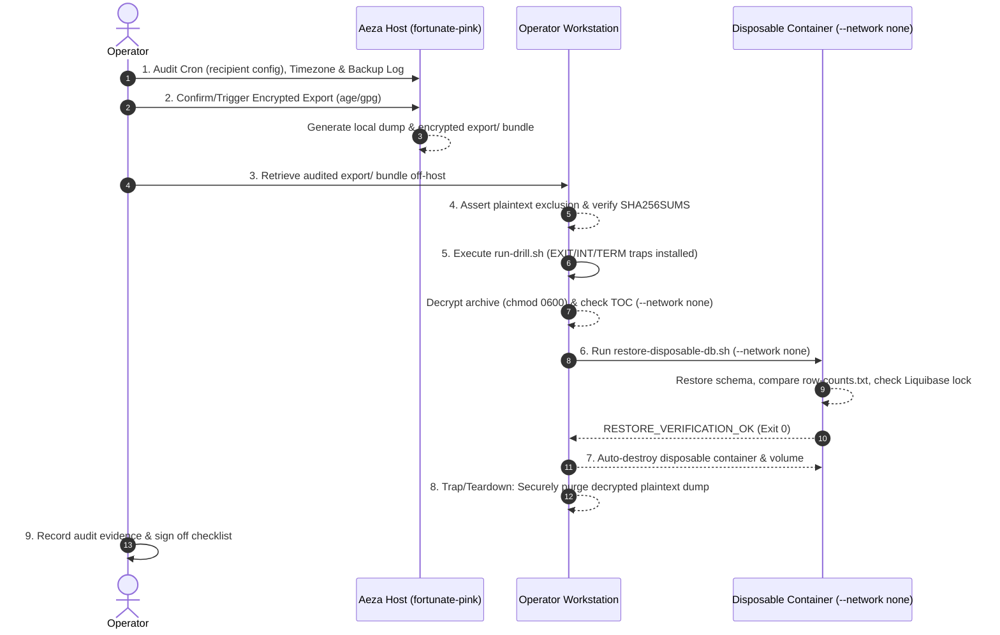

# Automated Off-Host Backup Restore Verification Drill Runbook & Checklist

- **Project:** JS Notebook
- **Component:** Production PostgreSQL Infrastructure & Disaster Recovery
- **Host:** Aeza VPS (`fortunate-pink`, IP `89.169.35.207`, user `deploy`)
- **Scope:** `aeza-migration-implementation-plan.md` §5 go/no-go gate "Automated off-host backups run and a restore was tested" & Phase D off-host backup verification items
- **Related Docs:** [`backup-restore.md`](./backup-restore.md), [`aeza-migration-implementation-plan.md`](./aeza-migration-implementation-plan.md), [`project.md`](./project.md)
- **Tracking Issues:** [`larchanka-training/js-notebook#158`](https://github.com/larchanka-training/js-notebook/issues/158) (historical DR runbook)
- **Tooling Pull Request:** [`larchanka-training/dmc-1-t2-notebook-mono#237`](https://github.com/larchanka-training/dmc-1-t2-notebook-mono/pull/237)

---

## 1. Objectives and Operational Scope

This runbook defines the operational protocol and evidence checklist required to verify off-host database restores and close the **§5 go/no-go gate "Automated off-host backups run and a restore was tested"** in [`aeza-migration-implementation-plan.md`](./aeza-migration-implementation-plan.md).

### Operational Separation: Pipeline Automation vs. Restore Drill

The full §5 go/no-go gate ("Automated off-host backups run and a restore was tested") encompasses two distinct operational requirements:

1. **Automated Scheduled Off-Host Backup Pipeline (Phase D items "Install and verify automated daily cron job" and "Configure and verify scheduled off-host replication"):**
   - The backup script executes automatically via host cron (`0 3 * * *` in UTC) with an effective public-key encryption recipient configured (`--encrypt-recipient` or environment variable `BACKUP_ENCRYPT_RECIPIENT`), producing an encrypted export bundle (`export/database.dump.age` or `export/database.dump.gpg`) on every scheduled run.
   - Encrypted bundles are automatically replicated/transported to an off-host storage destination without manual operator intervention.
   - Successful execution is proven by scheduled audit logs (`cron.log` and `backup.log`) confirming `Off-host export bundle created: OK` and `Daily backup completed: OK` at 03:00 UTC.
2. **Off-Host Restore Verification Drill (Phase D item "Decrypt and verify a fresh off-host backup"):**
   - A fresh, encrypted off-host backup bundle is decrypted on an isolated operator workstation.
   - The backup is restored inside an ephemeral, network-isolated Docker container (`--network none`).
   - Restored table row counts match the production snapshot with zero discrepancy ($\Delta = 0$).

Executing this drill satisfies requirement 2 (the restore test). Formal closure of the §5 backup gate requires recorded evidence for **both** the automated off-host pipeline (Part A) and the successful restore drill (Part B).

### Core Invariants & Safety Principles

1. **Zero Production Mutation:** The drill operates exclusively on decrypted backup archives inside an isolated disposable test container (`restore-disposable-db.sh`). The live production database (`jsnotes-production`) is **never touched, paused, unlocked, or restarted** during this drill.
2. **Strict Network Isolation (`--network none`):** Every container spawned during verification—including structural inspection (`pg_restore --list`) and database restoration—must run with `--network none`, ensuring zero egress, ingress, or network interface exposure.
3. **Plaintext Exclusion Invariant:** Only encrypted ciphertext archives (`database.dump.age` or `database.dump.gpg`) and cryptographic verification metadata (`SHA256SUMS`, `restore-list.txt`, `row-counts.txt`, `backup-meta.txt`) are permitted to leave the Aeza production VPS. Transfer of unencrypted `database.dump` off-host constitutes an immediate operational failure.
4. **Guaranteed Plaintext Cleanup on Success, Failure, or Interruption:** Plaintext `database.dump` generated during decryption must be created with restrictive permissions (`umask 077`, `chmod 0600`) inside a bounded execution wrapper equipped with a signal-aware cleanup trap (`trap cleanup_workstation EXIT` with explicit signal handlers `trap "exit 130" INT` and `trap "exit 143" TERM`). Decrypted plaintext is purged unconditionally on normal exit, on any failure (decryption error, TOC mismatch, or restore failure), and on handled interruption signals.
5. **Deterministic Equivalence:** A backup is accepted as valid if and only if:
   - Cryptographic SHA-256 checksums match the manifest (`SHA256SUMS`).
   - Restored table row counts match the source snapshot `row-counts.txt` across all user schemas (`public`, `users`, `notebooks`).
   - Core tables (`users.users`, `public.databasechangelog`) are strictly non-empty ($> 0$ rows).
   - Liquibase lock table (`public.databasechangeloglock`) contains exactly one row and is unlocked (`locked = false`).
6. **Clean Ephemeral Teardown:** All test volumes and containers must be automatically pruned upon script completion (`trap ... EXIT`).

---

## 2. Roles and Prerequisites

### Operational Actors

- **Drill Operator:** Responsible for auditing host cron, executing or fetching the encrypted export bundle, running the verification script on the workstation, and ensuring safe disposal of local plaintext.
- **Reviewer / Auditor:** Responsible for reviewing recorded terminal outputs, verifying SHA-256 hashes, and approving the Phase G checklist sign-off.

### Operator Workstation Prerequisites

- **SSH Access:** SSH key access to `deploy@89.169.35.207` (e.g. `~/.ssh/aeza-jsnotebook-prod`).
- **Decryption Key:** Private key matching the production recipient (`~/.ssh/backup-age-key` or GPG secret key).
- **Docker Engine:** Local Docker daemon running `postgres:16` image for disposable container verification.
- **POSIX Utilities:** `age` (or `gpg`), `shasum` (or `sha256sum`), `diff`, `docker`, `scp`, `ssh`.

---

## 3. Step-by-Step Drill Execution Protocol



---

### Stage 1: Aeza Production Host, Timezone & Cron Audit

Log in to the Aeza VPS and confirm that the automated cron job is active with a valid encryption recipient, directory permissions are compliant, host timezone is UTC, and disk space is sufficient.

```bash
# 1. Connect to production host
ssh -o IdentitiesOnly=yes -i ~/.ssh/aeza-jsnotebook-prod deploy@89.169.35.207

# 2. Confirm host timezone (must be UTC)
timedatectl || date +"%Z %z"

# 3. Verify crontab configuration for daily backup (03:00 UTC) with encryption recipient
crontab -l | grep 'backup-aeza\.sh' | grep -E '(--encrypt-recipient|BACKUP_ENCRYPT_RECIPIENT)'
```

*Expected Crontab Line (must include recipient flag or environment variable):*
```cron
0 3 * * * /home/deploy/jsnb-production/scripts/backup-aeza.sh --encrypt-recipient "age1..." >> /home/deploy/jsnb-backups/cron.log 2>&1
```
*(Alternatively, if `BACKUP_ENCRYPT_RECIPIENT` is exported via environment wrapper: `0 3 * * * BACKUP_ENCRYPT_RECIPIENT="age1..." /home/deploy/jsnb-production/scripts/backup-aeza.sh >> /home/deploy/jsnb-backups/cron.log 2>&1`)*

```bash
# 4. Check base directory permissions (must be drwx------ / 0700)
ls -ld /home/deploy/jsnb-backups

# 5. Check available disk space (must be >= 1 GiB free)
df -h /home/deploy/jsnb-backups

# 6. Inspect recent backup audit log entries for scheduled run status
tail -n 20 /home/deploy/jsnb-backups/backup.log
```

---

### Stage 2: Identify or Trigger Fresh Encrypted Export

If an automated daily backup generated by cron with a valid recipient already exists, identify it and verify that its `export/` bundle was generated. Otherwise, trigger an immediate execution of `backup-aeza.sh` specifying the public key recipient.

```bash
# Option A (Scheduled backup with encrypted export exists):
selected_daily="$(ls -td /home/deploy/jsnb-backups/daily/daily-* 2>/dev/null | head -n 1)"
[ -d "$selected_daily/export" ] || { echo "ERROR: No encrypted export found in $selected_daily" >&2; exit 1; }
echo "Selected daily backup: $selected_daily"

# Option B (Trigger fresh backup if testing on demand or post-cutover verification is needed):
# NOTE: Option B creates a manual drill artifact; it satisfies Part B (restore test),
# but does NOT substitute for automated scheduled cron execution in Part A.
/home/deploy/jsnb-production/scripts/backup-aeza.sh \
  --encrypt-recipient "age1..." # Replace with operator public age/gpg key
selected_daily="$(ls -td /home/deploy/jsnb-backups/daily/daily-* 2>/dev/null | head -n 1)"
echo "Fresh daily backup generated: $selected_daily"
```

*Verification on Aeza:*
```bash
# Verify export bundle structure
ls -la "$selected_daily/export"

# Assert that plaintext database.dump is strictly ABSENT in export/
if [ -f "$selected_daily/export/database.dump" ]; then
  echo "SECURITY VIOLATION: Plaintext dump found in export directory!" >&2
  exit 1
else
  echo "CONFIRMED: Plaintext dump excluded from export directory."
fi
```

---

### Stage 3: Workstation Initialization & Off-Host Transfer

Execute the following steps directly in the operator workstation shell to prepare the drill workspace and retrieve the audited bundle.

```bash
# Set up a dedicated drill working directory on the operator workstation
set -euo pipefail
umask 077

DRILL_TIMESTAMP="$(date -u +%Y%m%d_%H%M%SZ)"
DRILL_DIR="${DRILL_DIR:-$HOME/DevelopmentWorkspaces/backup/aeza-production/drill-$DRILL_TIMESTAMP}"
mkdir -p -m 700 "$DRILL_DIR/export"
cd "$DRILL_DIR"

# Identify the exact audited remote daily backup directory on Aeza
remote_bundle="${REMOTE_BUNDLE_DIR:-$(ssh -o IdentitiesOnly=yes -i ~/.ssh/aeza-jsnotebook-prod deploy@89.169.35.207 'ls -td /home/deploy/jsnb-backups/daily/daily-* | head -n 1')}"
echo "Identified remote backup bundle: $remote_bundle"

# Securely retrieve ONLY the export/ subdirectory off-host
scp -o IdentitiesOnly=yes -i ~/.ssh/aeza-jsnotebook-prod -r \
  "deploy@89.169.35.207:$remote_bundle/export" \
  "$DRILL_DIR/"

cd "$DRILL_DIR/export"

# Verify cryptographic checksums of the export bundle
shasum -a 256 --check SHA256SUMS

# Hard security assertion: Plaintext database.dump must NOT exist in the transferred bundle
if [ -f "database.dump" ]; then
  echo "CRITICAL FAILURE: Plaintext database.dump was transferred off-host!" >&2
  exit 1
fi

echo "STAGE 3 PASSED: Encrypted off-host bundle verified at $PWD"
```

---

### Stage 4 & 5: Dedicated Workstation Verification Runner with Signal-Safe Cleanup Trap

To ensure that decrypted plaintext is **unconditionally purged** upon any failure (decryption error, TOC mismatch, or restore failure), upon handled interruption signals (`SIGINT`, `SIGTERM`), as well as upon successful completion, execute the verification drill through a dedicated shell wrapper script.

```bash
# Create the self-contained workstation drill script with trap-guaranteed cleanup
cat << 'WORKSTATION_DRILL_SCRIPT' > "$DRILL_DIR/run-drill.sh"
#!/usr/bin/env bash
set -euo pipefail
umask 077

SCRIPT_DIR="$(cd "$(dirname "${BASH_SOURCE[0]}")" && pwd)"
DRILL_DIR="${DRILL_DIR:-$SCRIPT_DIR}"

# ------------------------------------------------------------------------------
# Signal-Safe Plaintext Cleanup Trap: Triggered on EXIT, INT, or TERM
# ------------------------------------------------------------------------------
cleanup_workstation() {
  local exit_code=$?
  # Unconditionally remove decrypted plaintext and temporary TOC verification files
  rm -f "$DRILL_DIR/export/database.dump" "$DRILL_DIR/export/verify-restore-list.txt"
  if [ "$exit_code" -ne 0 ]; then
    echo "========================================================================" >&2
    echo "DRILL ABORTED WITH FAILURE (code: $exit_code): Decrypted plaintext purged." >&2
    echo "Encrypted archive and execution logs preserved in: $DRILL_DIR" >&2
    echo "========================================================================" >&2
  fi
  exit "$exit_code"
}
trap cleanup_workstation EXIT
trap "exit 130" INT
trap "exit 143" TERM

cd "$DRILL_DIR/export"

# ------------------------------------------------------------------------------
# Stage 4: Off-Host Decryption & Isolated TOC Validation
# ------------------------------------------------------------------------------
echo "Decrypting archive with operator private key..."
if [ -f "database.dump.age" ]; then
  age -d -i ~/.ssh/backup-age-key database.dump.age > database.dump
elif [ -f "database.dump.gpg" ]; then
  gpg --decrypt database.dump.gpg > database.dump
else
  echo "ERROR: No supported encrypted dump archive found (expected database.dump.age or .gpg)." >&2
  exit 1
fi
chmod 600 database.dump

echo "Validating Table of Contents (TOC) via pg_restore --list (--network none)..."
docker run --rm -i --network none postgres:16 pg_restore --list < database.dump > verify-restore-list.txt

echo "Comparing TOC against recorded restore-list.txt..."
diff -u restore-list.txt verify-restore-list.txt
echo "STAGE 4 PASSED: TOC matches manifest."

# ------------------------------------------------------------------------------
# Stage 5: Isolated Disposable Restore Verification (Scenario D-08)
# ------------------------------------------------------------------------------
echo "Executing disposable database restore verification..."
RESTORE_SCRIPT="$HOME/DevelopmentWorkspaces/projects/js-notebook/project/scripts/restore-disposable-db.sh"
[ -f "$RESTORE_SCRIPT" ] || { echo "ERROR: Restore script not found at $RESTORE_SCRIPT" >&2; exit 1; }

"$RESTORE_SCRIPT" "$DRILL_DIR/export" 2>&1 | tee "$DRILL_DIR/restore.log"

grep -q "RESTORE_VERIFICATION_OK" "$DRILL_DIR/restore.log" || {
  echo "ERROR: Script output missing RESTORE_VERIFICATION_OK." >&2
  exit 1
}

echo "STAGE 5 PASSED: Disposable restore verified cleanly."

# Normal cleanup before script exit
rm -f "$DRILL_DIR/export/database.dump" "$DRILL_DIR/export/verify-restore-list.txt"
echo "STAGE 4-5 COMPLETE: Verification passed; plaintext dump removed."
WORKSTATION_DRILL_SCRIPT

chmod +x "$DRILL_DIR/run-drill.sh"

# Execute the drill runner and record execution log
"$DRILL_DIR/run-drill.sh" 2>&1 | tee "$DRILL_DIR/drill.log"
```

*Expected Script Output Snippet in `restore.log`:*
```text
Verifying SHA256 checksums from .../SHA256SUMS...
database.dump.age: OK
restore-list.txt: OK
row-counts.txt: OK
backup-meta.txt: OK
Checksum verification: OK
Creating disposable volume 'jsnb-restore-check-YYYYMMDD...-data'...
Starting isolated test PostgreSQL container 'jsnb-restore-check-YYYYMMDD...' (--network none)...
Waiting for PostgreSQL TCP readiness (timeout: 60s)...
PostgreSQL is ready.
Restoring database from '.../database.dump'...
pg_restore completed successfully.
Querying restored table counts across schemas...
Restored table counts:
notebooks.notebook_ai_context	0
notebooks.notebooks	<N>
public.databasechangelog	<N>
public.databasechangeloglock	1
users.llm_cost_bounds	<N>
users.llm_daily_cost_counters	<N>
users.llm_monthly_cost_counters	<N>
users.llm_quota_counters	<N>
users.llm_reservations	<N>
users.otps	<N>
users.refresh_tokens	<N>
users.sessions	<N>
users.users	<N>
Comparing restored table counts against expected snapshot '.../row-counts.txt'...
Row count equivalence: OK (exact match across all tracked tables)
Asserting non-emptiness and integrity of core tables...
Table 'users.users': <N> rows (>0 OK)
Table 'public.databasechangelog': <N> changesets (>0 OK)
Liquibase lock status: UNLOCKED (locked=f OK)
========================================================================
RESTORE_VERIFICATION_OK: container=jsnb-restore-check-... volume=...
All consistency, schema, and row-count equivalence checks passed.
========================================================================
Tearing down disposable container 'jsnb-restore-check-...' and volume '...'
```

---

### Stage 6: Teardown, Plaintext Absence & Docker Invariant Audit

Verify that decrypted plaintext has been eliminated and that no lingering test containers or volumes exist, failing closed if any resources remain.

```bash
# 1. Assert plaintext dump absence
if [ -f "$DRILL_DIR/export/database.dump" ]; then
  echo "CRITICAL FAILURE: Plaintext database.dump is still present on workstation!" >&2
  exit 1
else
  echo "CONFIRMED: Plaintext dump is absent."
fi

# 2. Fail closed if any lingering restore test containers exist
lingering_containers="$(docker ps -aq --filter "name=jsnb-restore-check-")"
if [ -n "$lingering_containers" ]; then
  echo "CRITICAL FAILURE: Lingering restore containers detected: $lingering_containers" >&2
  exit 1
else
  echo "CONFIRMED: Zero lingering restore containers."
fi

# 3. Fail closed if any lingering restore test volumes exist
lingering_volumes="$(docker volume ls -q --filter "name=jsnb-restore-check-")"
if [ -n "$lingering_volumes" ]; then
  echo "CRITICAL FAILURE: Lingering restore volumes detected: $lingering_volumes" >&2
  exit 1
else
  echo "CONFIRMED: Zero lingering restore volumes."
fi

echo "STAGE 6 PASSED: Ephemeral resources and local plaintext cleanly disposed."
```

---

## 4. Operational Evidence Checklist & Sign-Off Template

When performing the drill, record actual values in this checklist table. This table serves as the primary artifact to justify closing the §5 backup gate.

### Part A: Automated Off-Host Backup Pipeline Verification

| Item | Invariant / Claim | Verification Command | Expected Criterion | Actual Recorded Output | Status |
|---|---|---|---|---|---|
| **E-01** | Daily Cron Scheduled with Recipient | `ssh deploy@89.169.35.207 "crontab -l \| grep 'backup-aeza\.sh' \| grep -E '(--encrypt-recipient\|BACKUP_ENCRYPT_RECIPIENT)'"` | `0 3 * * * ... backup-aeza.sh --encrypt-recipient "age1..."` (or env set) | | [ ] |
| **E-02** | Timezone Configured | `ssh deploy@89.169.35.207 "timedatectl \|\| date +'%Z %z'"` | `UTC` / `+0000` | | [ ] |
| **E-03** | Backup Directory Security | `ssh deploy@89.169.35.207 "ls -ld /home/deploy/jsnb-backups"` | Mode `0700` (`drwx------`) | | [ ] |
| **E-04** | Disk Space Guard | `ssh deploy@89.169.35.207 "df -Pk /home/deploy/jsnb-backups"` | Free space $\ge 1048576$ KB (1 GiB) | | [ ] |
| **E-05** | Scheduled Run Log & Export Creation | `ssh deploy@89.169.35.207 "grep -E 'Daily backup completed: OK\|Off-host export bundle created: OK' /home/deploy/jsnb-backups/backup.log \| tail -n 2"` | Confirms `Off-host export bundle created: OK` and `Daily backup completed: OK` at 03:00 UTC | | [ ] |
| **E-06** | Automated Off-Host Replication | Off-host storage audit matching bundle ID/timestamp and digest | Automated receipt of corresponding `database.dump.age` (or `.gpg`) and `SHA256SUMS` | | [ ] |

### Part B: Off-Host Restore Verification Drill

| Item | Invariant / Claim | Verification Command | Expected Criterion | Actual Recorded Output | Status |
|---|---|---|---|---|---|
| **E-07** | Plaintext Exclusion | `test ! -f export/database.dump` on pulled bundle | Plaintext absent in transferred bundle | | [ ] |
| **E-08** | SHA256 Export Integrity | `shasum -a 256 --check SHA256SUMS` | All export files return `OK` | | [ ] |
| **E-09** | Workstation Cleanup Trap Active | Verification of `trap cleanup_workstation EXIT` and signal traps in `run-drill.sh` | Cleanup trap active before decryption; INT (130) / TERM (143) | | [ ] |
| **E-10** | Decryption & TOC Equivalence | `grep -E 'STAGE 4 PASSED: TOC matches manifest' drill.log` | Log confirms TOC matched manifest and diff exited 0 | | [ ] |
| **E-11** | Network Isolation Enforced | `grep -E 'Starting isolated test PostgreSQL container .* \(--network none\)' restore.log` | Container startup with `--network none` | | [ ] |
| **E-12** | Database Restoration | `grep -E 'pg_restore completed successfully' restore.log` | Restoration completed cleanly | | [ ] |
| **E-13** | Row-Count Equivalence | `grep -E 'Row count equivalence: OK' restore.log` | Exact match across all tracked tables | | [ ] |
| **E-14** | Core Tables Non-Empty | `grep -E "Table 'users\.users': [1-9][0-9]* rows" restore.log && grep -E "Table 'public\.databasechangelog': [1-9][0-9]* changesets" restore.log` | $> 0$ rows in `users.users` and `databasechangelog` | | [ ] |
| **E-15** | Liquibase Lock Free | `grep -E 'Liquibase lock status: UNLOCKED' restore.log` | `locked = false` confirmed | | [ ] |
| **E-16** | Teardown & Plaintext Disposal | `test ! -f export/database.dump` & assert zero lingering test containers/volumes | Zero lingering containers/volumes and no plaintext dump | | [ ] |

---

## 5. Failure Modes and Recovery Procedures

| Failure Symptom | Probable Cause | Remediation Procedure |
|---|---|---|
| `Pre-flight disk space check failed` | Target partition has $< 1$ GiB available space | Inspect disk usage with `du -sh /home/deploy/jsnb-backups/*`. Prune expired local archives or purge unused Docker images (`docker image prune`). |
| `Loose permissions detected on .env.prod` | File mode is not `0600` | Execute `chmod 600 /home/deploy/jsnb-production/.env.prod` and re-run. |
| `Checksum verification failed for database.dump.age` | Network corruption during transport | Delete local directory and re-fetch bundle via `scp`. Re-run `shasum -a 256 --check SHA256SUMS`. |
| `Decryption error (age / gpg)` | Mismatched private key or missing passphrase | Confirm `~/.ssh/backup-age-key` matches the recipient public key used during `backup-aeza.sh`. The cleanup trap purges any partial decrypted dump. |
| `Row count equivalence mismatch` | Transaction committed between snapshot and table count capture | Confirm `backup-aeza.sh` synchronized `pg_dump` with exported transaction snapshot (`BEGIN TRANSACTION ISOLATION LEVEL REPEATABLE READ READ ONLY; SELECT pg_export_snapshot();`). Re-run backup during a quiescent period. |
| `databasechangeloglock is LOCKED` | Migration was in flight or crashed during backup generation | **DO NOT mutate or unlock the production database.** Stop the drill. Check production migration status and logs in a read-only manner. If a migration was in progress, re-run backup after migration completes cleanly. |
| `Container failed to start (timeout waiting for TCP)` | Port or memory exhaustion on operator machine | Ensure local Docker daemon is healthy. Run with `--timeout 120` or `--pg-image postgres:16`. |

---

## 6. Backup Gate Sign-Off Protocol

The sign-off protocol enforces strict evidence boundaries:

1. **Partial Completion (Restore Test Only):**
   - If the operator successfully completes **Part B (items E-07 through E-16)** via a manual transfer drill, mark the following Phase D item in [`project/docs/aeza-migration-implementation-plan.md`](./aeza-migration-implementation-plan.md) as complete:
     `- [x] Decrypt and verify a fresh off-host backup in disposable database with post-cutover production data.`
   - Keep the §5 backup gate **open (`[ ]`)** because automated off-host replication is not yet verified.
2. **Full §5 Backup Gate Closure:**
   - When **both Part A (items E-01 through E-06)** and **Part B (items E-07 through E-16)** are verified with recorded operational evidence:
     Transition the §5 go/no-go item "Automated off-host backups run and a restore was tested" in [`project/docs/aeza-migration-implementation-plan.md`](./aeza-migration-implementation-plan.md) to:
     ```markdown
     - [x] Automated off-host backups run and a restore was tested (verified via drill runbook `docs/backup-restore-drill-runbook.md` on YYYY-MM-DD; post-cutover fresh off-host restore passed all row-count and schema checks).
     ```
   - In [`project/docs/project.md`](./project.md), update the "Host backup cron activation and off-host restore verification drill execution" roadmap row to `Done`.
3. **Commit Verification Evidence:**
   - Record the executed drill log and audit table in a dated session artifact under `docs/reviews/` in the outer workspace.
