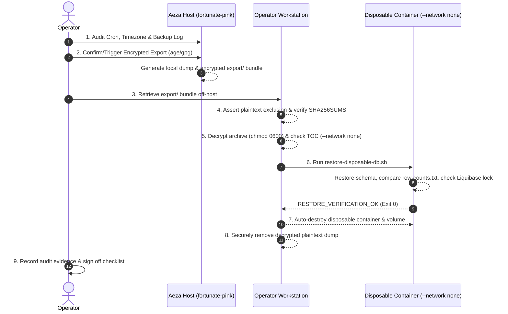

# Automated Off-Host Backup Restore Verification Drill Runbook & Checklist

- **Project:** JS Notebook
- **Component:** Production PostgreSQL Infrastructure & Disaster Recovery
- **Host:** Aeza VPS (`fortunate-pink`, IP `89.169.35.207`, user `deploy`)
- **Scope:** Phase G Operational Exit Gate 243 & Phase D Operational Verification (items 136–138)
- **Related Docs:** [`backup-restore.md`](./backup-restore.md), [`aeza-migration-implementation-plan.md`](./aeza-migration-implementation-plan.md), [`project.md`](./project.md)
- **Tracking Issues:** [`larchanka-training/js-notebook#158`](https://github.com/larchanka-training/js-notebook/issues/158) (historical DR runbook)
- **Tooling Pull Request:** [`larchanka-training/dmc-1-t2-notebook-mono#237`](https://github.com/larchanka-training/dmc-1-t2-notebook-mono/pull/237)

---

## 1. Objectives and Operational Scope

This runbook defines the operational protocol and evidence checklist required to verify off-host database restores and close **Phase G item 243** in [`aeza-migration-implementation-plan.md`](./aeza-migration-implementation-plan.md).

### Operational Separation: Pipeline Automation vs. Restore Drill

The full Phase G gate 243 ("Automated off-host backups run and a restore was tested") encompasses two distinct operational requirements:

1. **Automated Scheduled Off-Host Backup Pipeline (Phase D items 136–137):**
   - The backup script executes automatically via host cron (`0 3 * * *` in UTC).
   - Backups are encrypted with a designated recipient key (`--encrypt-recipient`) without manual intervention.
   - Encrypted bundles are automatically replicated/transported to an off-host storage destination.
2. **Off-Host Restore Verification Drill (Phase D item 138):**
   - A fresh, encrypted off-host backup bundle is decrypted on an isolated operator workstation.
   - The backup is restored inside an ephemeral, network-isolated Docker container (`--network none`).
   - Restored table row counts match the production snapshot with zero discrepancy ($\Delta = 0$).

Executing this drill satisfies requirement 2 (the restore test). Formal closure of Phase G item 243 requires recorded evidence for **both** the automated off-host pipeline (Part A) and the successful restore drill (Part B).

### Core Invariants & Safety Principles

1. **Zero Production Mutation:** The drill operates exclusively on decrypted backup archives inside an isolated disposable test container (`restore-disposable-db.sh`). The live production database (`jsnotes-production`) is **never touched, paused, unlocked, or restarted** during this drill.
2. **Strict Network Isolation (`--network none`):** Every container spawned during verification—including structural inspection (`pg_restore --list`) and database restoration—must run with `--network none`, ensuring zero egress, ingress, or network interface exposure.
3. **Plaintext Exclusion Invariant:** Only encrypted ciphertext archives (`database.dump.age` or `database.dump.gpg`) and cryptographic verification metadata (`SHA256SUMS`, `restore-list.txt`, `row-counts.txt`, `backup-meta.txt`) are permitted to leave the Aeza production VPS. Transfer of unencrypted `database.dump` off-host constitutes an immediate operational failure.
4. **Controlled Plaintext Lifecycle on Workstation:** Plaintext `database.dump` generated during decryption must be created with restrictive permissions (`umask 077`, `chmod 0600`) and promptly removed after the verification checks finish.
5. **Deterministic Equivalence:** A backup is accepted as valid if and only if:
   - Cryptographic SHA-256 checksums match the manifest (`SHA256SUMS`).
   - Restored table row counts match the source snapshot `row-counts.txt` across all user schemas (`public`, `users`, `notebooks`).
   - Core tables (`users.users`, `public.databasechangelog`) are strictly non-empty ($> 0$ rows).
   - Liquibase lock table (`public.databasechangeloglock`) contains exactly one row and is unlocked (`locked = false`).
6. **Clean Ephemeral Teardown:** All test volumes and containers must be automatically pruned upon script completion (`trap ... EXIT`).

---

## 2. Roles and Prerequisites

### Operational Actors

- **Drill Operator:** Responsible for auditing host cron, executing or fetching the encrypted export bundle, running the verification script on the workstation, and securely disposing of local plaintext.
- **Reviewer / Auditor:** Responsible for reviewing recorded terminal outputs, verifying SHA-256 hashes, and approving the Phase G checklist sign-off.

### Operator Workstation Prerequisites

- **SSH Access:** SSH key access to `deploy@89.169.35.207` (e.g. `~/.ssh/aeza-jsnotebook-prod`).
- **Decryption Key:** Private key matching the production recipient (`~/.ssh/backup-age-key` or GPG secret key).
- **Docker Engine:** Local Docker daemon running `postgres:16` image for disposable container verification.
- **POSIX Utilities:** `age` (or `gpg`), `shasum` (or `sha256sum`), `diff`, `docker`, `scp`, `ssh`.

---

## 3. Step-by-Step Drill Execution Protocol



---

### Stage 1: Aeza Production Host, Timezone & Cron Audit

Log in to the Aeza VPS and confirm that the automated cron job is active, directory permissions are compliant, host timezone is UTC, and disk space is sufficient.

```bash
# 1. Connect to production host
ssh -o IdentitiesOnly=yes -i ~/.ssh/aeza-jsnotebook-prod deploy@89.169.35.207

# 2. Confirm host timezone (must be UTC)
timedatectl || date +"%Z %z"

# 3. Verify crontab configuration for daily backup (03:00 UTC)
crontab -l | grep -E 'backup-aeza\.sh'
```

*Expected Crontab Line:*
```cron
0 3 * * * /home/deploy/jsnb-production/scripts/backup-aeza.sh >> /home/deploy/jsnb-backups/cron.log 2>&1
```

```bash
# 4. Check base directory permissions (must be drwx------ / 0700)
ls -ld /home/deploy/jsnb-backups

# 5. Check available disk space (must be >= 1 GiB free)
df -h /home/deploy/jsnb-backups

# 6. Inspect recent backup audit log entries for scheduled run status
tail -n 20 /home/deploy/jsnb-backups/backup.log
```

---

### Stage 2: Identify or Trigger Fresh Encrypted Export

If an automated daily backup generated by cron with a valid recipient already exists, identify it. Otherwise, trigger an immediate execution of `backup-aeza.sh` specifying the public key recipient.

```bash
# Option A (Scheduled backup exists):
latest_daily="$(ls -td /home/deploy/jsnb-backups/daily/daily-* 2>/dev/null | head -n 1)"
echo "Selected daily backup: $latest_daily"

# Option B (Trigger fresh backup if none exists or post-cutover verification is needed):
/home/deploy/jsnb-production/scripts/backup-aeza.sh \
  --encrypt-recipient "age1..." # Replace with operator public age/gpg key
```

*Verification on Aeza:*
```bash
# Verify export bundle structure
ls -la "$latest_daily/export"

# Assert that plaintext database.dump is strictly ABSENT in export/
if [ -f "$latest_daily/export/database.dump" ]; then
  echo "SECURITY VIOLATION: Plaintext dump found in export directory!" >&2
  exit 1
else
  echo "CONFIRMED: Plaintext dump excluded from export directory."
fi
```

---

### Stage 3: Workstation Initialization & Off-Host Transfer

Execute the following steps directly in the operator workstation shell (do not run in a subshell, ensuring environment variables persist across stages).

```bash
# Set up a dedicated drill working directory on the operator workstation
set -euo pipefail
umask 077

DRILL_TIMESTAMP="$(date -u +%Y%m%d_%H%M%SZ)"
DRILL_DIR="${DRILL_DIR:-$HOME/DevelopmentWorkspaces/backup/aeza-production/drill-$DRILL_TIMESTAMP}"
mkdir -p -m 700 "$DRILL_DIR/export"
cd "$DRILL_DIR"

# Identify latest remote daily backup directory on Aeza
remote_latest="$(ssh -o IdentitiesOnly=yes -i ~/.ssh/aeza-jsnotebook-prod deploy@89.169.35.207 \
  'ls -td /home/deploy/jsnb-backups/daily/daily-* | head -n 1')"

echo "Identified remote backup: $remote_latest"

# Securely retrieve ONLY the export/ subdirectory off-host
scp -o IdentitiesOnly=yes -i ~/.ssh/aeza-jsnotebook-prod -r \
  "deploy@89.169.35.207:$remote_latest/export" \
  "$DRILL_DIR/"

cd "$DRILL_DIR/export"

# Verify cryptographic checksums of the export bundle
shasum -a 256 --check SHA256SUMS

# Hard security assertion: Plaintext database.dump must NOT exist in the transferred bundle
if [ -f "database.dump" ]; then
  echo "CRITICAL FAILURE: Plaintext database.dump was transferred off-host!" >&2
  exit 1
fi

echo "STAGE 3 PASSED: Encrypted off-host bundle verified at $PWD"
```

---

### Stage 4: Off-Host Archive Decryption & Isolated TOC Validation

Execute on the operator workstation inside `$DRILL_DIR/export`.

```bash
cd "$DRILL_DIR/export"

# Decrypt the archive using the private key
if [ -f "database.dump.age" ]; then
  age -d -i ~/.ssh/backup-age-key database.dump.age > database.dump
elif [ -f "database.dump.gpg" ]; then
  gpg --decrypt database.dump.gpg > database.dump
else
  echo "ERROR: No supported encrypted dump archive found." >&2
  exit 1
fi
chmod 600 database.dump

# Verify dump archive structure via pg_restore --list in an isolated container (--network none)
docker run --rm -i --network none postgres:16 pg_restore --list < database.dump > verify-restore-list.txt

# Compare Table of Contents (TOC) with recorded manifest
diff -u restore-list.txt verify-restore-list.txt

echo "STAGE 4 PASSED: Archive successfully decrypted and TOC matches manifest."
```

---

### Stage 5: Isolated Disposable Restore Verification (Scenario D-08)

Execute the canonical restore verification script [`project/scripts/restore-disposable-db.sh`](../scripts/restore-disposable-db.sh) against the decrypted drill directory on the workstation, capturing the log.

```bash
cd "$DRILL_DIR"

# Execute disposable restore verification and capture output
"$HOME/DevelopmentWorkspaces/projects/js-notebook/project/scripts/restore-disposable-db.sh" "$DRILL_DIR/export" 2>&1 | tee restore.log

# Assert successful verification status
grep -q "RESTORE_VERIFICATION_OK" restore.log || { echo "RESTORE VERIFICATION FAILED" >&2; exit 1; }

echo "STAGE 5 PASSED: Disposable restore verified cleanly."
```

*Expected Script Output Snippet in `restore.log`:*
```text
Verifying SHA256 checksums from .../SHA256SUMS...
database.dump.age: OK
restore-list.txt: OK
row-counts.txt: OK
backup-meta.txt: OK
Checksum verification: OK
Creating disposable volume 'jsnb-restore-check-YYYYMMDD...-data'...
Starting isolated test PostgreSQL container 'jsnb-restore-check-YYYYMMDD...' (--network none)...
Waiting for PostgreSQL TCP readiness (timeout: 60s)...
PostgreSQL is ready.
Restoring database from '.../database.dump'...
pg_restore completed successfully.
Querying restored table counts across schemas...
Restored table counts:
notebooks.notebook_ai_context	0
notebooks.notebooks	<N>
public.databasechangelog	<N>
public.databasechangeloglock	1
users.llm_cost_bounds	<N>
users.llm_daily_cost_counters	<N>
users.llm_monthly_cost_counters	<N>
users.llm_quota_counters	<N>
users.llm_reservations	<N>
users.otps	<N>
users.refresh_tokens	<N>
users.sessions	<N>
users.users	<N>
Comparing restored table counts against expected snapshot '.../row-counts.txt'...
Row count equivalence: OK (exact match across all tracked tables)
Asserting non-emptiness and integrity of core tables...
Table 'users.users': <N> rows (>0 OK)
Table 'public.databasechangelog': <N> changesets (>0 OK)
Liquibase lock status: UNLOCKED (locked=f OK)
========================================================================
RESTORE_VERIFICATION_OK: container=jsnb-restore-check-... volume=...
All consistency, schema, and row-count equivalence checks passed.
========================================================================
Tearing down disposable container 'jsnb-restore-check-...' and volume '...'
```

---

### Stage 6: Teardown, Plaintext Disposal & Docker Invariant Audit

Ensure that the script cleanly pruned all ephemeral test resources and that decrypted plaintext is securely disposed of.

```bash
# 1. Plaintext disposal: Remove decrypted dump and temporary TOC file
rm -f "$DRILL_DIR/export/database.dump" "$DRILL_DIR/export/verify-restore-list.txt"

# 2. Verify no lingering restore containers
docker ps -a --filter "name=jsnb-restore-check-"

# 3. Verify no lingering restore volumes
docker volume ls --filter "name=jsnb-restore-check-"

# 4. Verify plaintext dump absence
test ! -f "$DRILL_DIR/export/database.dump" && echo "CONFIRMED: Plaintext dump removed."

echo "STAGE 6 PASSED: Ephemeral resources and local plaintext cleanly disposed."
```

---

## 4. Operational Evidence Checklist & Sign-Off Template

When performing the drill, record actual values in this checklist table. This table serves as the primary artifact to justify closing Phase G item 243.

### Part A: Automated Off-Host Backup Pipeline Verification

| Item | Invariant / Claim | Verification Command | Expected Criterion | Actual Recorded Output | Status |
|---|---|---|---|---|---|
| **E-01** | Daily Cron Scheduled | `ssh deploy@89.169.35.207 "crontab -l"` | `0 3 * * * ... backup-aeza.sh` | | [ ] |
| **E-02** | Timezone Configured | `ssh deploy@89.169.35.207 "timedatectl \|\| date +'%Z %z'"` | `UTC` / `+0000` | | [ ] |
| **E-03** | Backup Directory Security | `ssh deploy@89.169.35.207 "ls -ld /home/deploy/jsnb-backups"` | Mode `0700` (`drwx------`) | | [ ] |
| **E-04** | Disk Space Guard | `ssh deploy@89.169.35.207 "df -Pk /home/deploy/jsnb-backups"` | Free space $\ge 1048576$ KB (1 GiB) | | [ ] |
| **E-05** | Scheduled Run Log | `ssh deploy@89.169.35.207 "tail -n 20 /home/deploy/jsnb-backups/backup.log"` | Clean exit `0` logged at 03:00 UTC | | [ ] |
| **E-06** | Off-Host Transport Job | Off-host replication job log or scheduled sync status | Automated delivery of `.enc`/`.age` | | [ ] |

### Part B: Off-Host Restore Verification Drill

| Item | Invariant / Claim | Verification Command | Expected Criterion | Actual Recorded Output | Status |
|---|---|---|---|---|---|
| **E-07** | Plaintext Exclusion | `test ! -f export/database.dump` on pulled bundle | Plaintext absent in transferred bundle | | [ ] |
| **E-08** | SHA256 Export Integrity | `shasum -a 256 --check SHA256SUMS` | All export files return `OK` | | [ ] |
| **E-09** | Decryption & TOC Equivalence | `diff -u restore-list.txt verify-restore-list.txt` | Clean diff, exit code `0` | | [ ] |
| **E-10** | Network Isolation Enforced | `grep -E 'Starting isolated test PostgreSQL container .* \(--network none\)' restore.log` | Container startup with `--network none` | | [ ] |
| **E-11** | Database Restoration | `grep -E 'pg_restore completed successfully' restore.log` | Restoration completed cleanly | | [ ] |
| **E-12** | Row-Count Equivalence | `grep -E 'Row count equivalence: OK' restore.log` | Exact match across all tracked tables | | [ ] |
| **E-13** | Core Tables Non-Empty | `grep -E 'Table .users\.users.: [1-9][0-9]* rows' restore.log` | $> 0$ rows in `users.users` and `databasechangelog` | | [ ] |
| **E-14** | Liquibase Lock Free | `grep -E 'Liquibase lock status: UNLOCKED' restore.log` | `locked = false` confirmed | | [ ] |
| **E-15** | Teardown & Plaintext Disposal | `test ! -f export/database.dump` & Docker filter commands | Zero lingering containers/volumes and no plaintext dump | | [ ] |

---

## 5. Failure Modes and Recovery Procedures

| Failure Symptom | Probable Cause | Remediation Procedure |
|---|---|---|
| `Pre-flight disk space check failed` | Target partition has $< 1$ GiB available space | Inspect disk usage with `du -sh /home/deploy/jsnb-backups/*`. Prune expired local archives or purge unused Docker images (`docker image prune`). |
| `Loose permissions detected on .env.prod` | File mode is not `0600` | Execute `chmod 600 /home/deploy/jsnb-production/.env.prod` and re-run. |
| `Checksum verification failed for database.dump.age` | Network corruption during transport | Delete local directory and re-fetch bundle via `scp`. Re-run `shasum -a 256 --check SHA256SUMS`. |
| `Decryption error (age / gpg)` | Mismatched private key or missing passphrase | Confirm `~/.ssh/backup-age-key` matches the recipient public key used during `backup-aeza.sh`. |
| `Row count equivalence mismatch` | Transaction committed between snapshot and table count capture | Confirm `backup-aeza.sh` synchronized `pg_dump` with exported transaction snapshot (`BEGIN TRANSACTION ISOLATION LEVEL REPEATABLE READ READ ONLY; SELECT pg_export_snapshot();`). Re-run backup during a quiescent period. |
| `databasechangeloglock is LOCKED` | Migration was in flight or crashed during backup generation | **DO NOT mutate or unlock the production database.** Stop the drill. Check production migration status and logs in a read-only manner. If a migration was in progress, re-run backup after migration completes cleanly. |
| `Container failed to start (timeout waiting for TCP)` | Port or memory exhaustion on operator machine | Ensure local Docker daemon is healthy. Run with `--timeout 120` or `--pg-image postgres:16`. |

---

## 6. Phase G Exit Gate Sign-Off Protocol

The sign-off protocol enforces strict evidence boundaries:

1. **Partial Completion (Restore Test Only):**
   - If the operator successfully completes **Part B (items E-07 through E-15)** via a manual transfer drill, mark Phase D item 138 in [`project/docs/aeza-migration-implementation-plan.md`](./aeza-migration-implementation-plan.md) as complete:
     `- [x] Decrypt and verify a fresh off-host backup in disposable database with post-cutover production data.`
   - Keep Phase G item 243 **open (`[ ]`)** because automated off-host replication is not yet verified.
2. **Full Phase G Gate 243 Closure:**
   - When **both Part A (items E-01 through E-06)** and **Part B (items E-07 through E-15)** are verified with recorded operational evidence:
     Transition line 246 in [`project/docs/aeza-migration-implementation-plan.md`](./aeza-migration-implementation-plan.md) to:
     ```markdown
     - [x] Automated off-host backups run and a restore was tested (verified via drill runbook `docs/backup-restore-drill-runbook.md` on YYYY-MM-DD; post-cutover fresh off-host restore passed all row-count and schema checks).
     ```
   - In [`project/docs/project.md`](./project.md) line 38, update milestone status to `Done`.
3. **Commit Verification Evidence:**
   - Record the executed drill log and audit table in a dated session artifact under `docs/reviews/` in the outer workspace.
