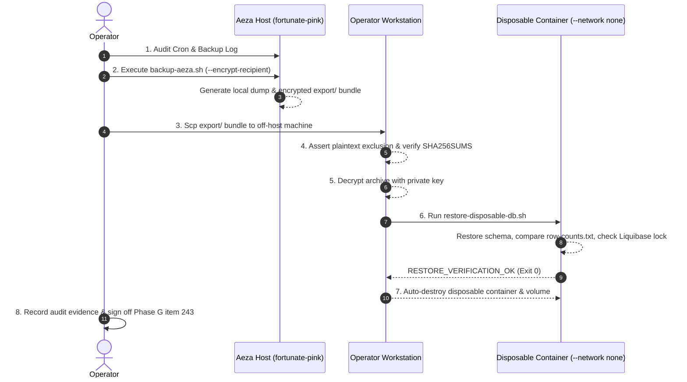

# Automated Off-Host Backup Restore Verification Drill Runbook & Checklist

**Project:** JS Notebook  
**Component:** Production PostgreSQL Infrastructure & Disaster Recovery  
**Host:** Aeza VPS (`fortunate-pink`, IP `89.169.35.207`, user `deploy`)  
**Scope:** Phase G Operational Exit Gate 243 & Phase D Operational Verification (items 136–138)  
**Related Docs:** [`backup-restore.md`](./backup-restore.md), [`aeza-migration-implementation-plan.md`](./aeza-migration-implementation-plan.md), [`project.md`](./project.md)  
**Tracking Issues:** [`larchanka-training/js-notebook#158`](https://github.com/larchanka-training/js-notebook/issues/158) (historical DR runbook)  
**Tooling Pull Request:** [`larchanka-training/dmc-1-t2-notebook-mono#237`](https://github.com/larchanka-training/dmc-1-t2-notebook-mono/pull/237)

---

## 1. Objectives and Operational Scope

This runbook defines the mandatory verification drill required to close **Phase G item 243** ("Automated off-host backups run and a restore was tested") in [`aeza-migration-implementation-plan.md`](./aeza-migration-implementation-plan.md).

### Core Invariants & Safety Principles

1. **Zero Production Mutation:** The drill operates exclusively on decrypted backup archives inside an isolated disposable test container (`restore-disposable-db.sh`). The live production database (`jsnotes-production`) is **never touched, paused, or restarted** during this drill.
2. **Network Isolation:** Disposable restore verification containers execute with `--network none`, ensuring zero egress, ingress, or port collision with production services.
3. **Plaintext Exclusion Invariant:** Only encrypted ciphertext archives (`database.dump.age` or `database.dump.gpg`) and cryptographic verification metadata (`SHA256SUMS`, `restore-list.txt`, `row-counts.txt`, `backup-meta.txt`) are permitted to leave the Aeza production VPS. Transfer of unencrypted `database.dump` off-host constitutes an immediate security failure.
4. **Deterministic Equivalence:** A backup is accepted as valid if and only if:
   - Cryptographic SHA-256 checksums match the manifest.
   - Restored table row counts match the source snapshot `row-counts.txt` across all user schemas (`public`, `users`, `notebooks`).
   - Core tables (`users.users`, `public.databasechangelog`) are strictly non-empty ($> 0$ rows).
   - Liquibase lock table (`public.databasechangeloglock`) contains exactly one row and is unlocked (`locked = false`).
5. **Clean Disposable Teardown:** All test volumes and containers must be automatically pruned upon script completion (`trap ... EXIT`).

---

## 2. Roles and Prerequisites

### Operational Actors

- **Drill Operator:** Responsible for executing host commands, pulling the encrypted export bundle, and running the verification script.
- **Reviewer / Auditor:** Responsible for reviewing recorded terminal outputs, verifying SHA-256 hashes, and approving the Phase G checklist sign-off.

### Operator Machine Prerequisites

- **SSH Access:** SSH key access to `deploy@89.169.35.207` (e.g. `~/.ssh/aeza-jsnotebook-prod`).
- **Decryption Key:** Decryption key matching the production recipient (`~/.ssh/backup-age-key` or GPG secret key).
- **Docker Engine:** Local Docker daemon running `postgres:16` image for disposable container verification.
- **POSIX Utilities:** `shasum` (or `sha256sum`), `diff`, `docker`, `scp`, `ssh`.

---

## 3. Step-by-Step Drill Execution Protocol



---

### Stage 1: Aeza Production Host & Cron Audit

Log in to the Aeza VPS and confirm that the automated cron job is active, directory permissions are compliant, and disk space is sufficient.

```bash
# 1. Connect to production host
ssh -o IdentitiesOnly=yes -i ~/.ssh/aeza-jsnotebook-prod deploy@89.169.35.207

# 2. Verify crontab configuration for daily backup (03:00 UTC)
crontab -l | grep -E 'backup-aeza\.sh'
```

*Expected Output:*
```cron
0 3 * * * /home/deploy/jsnb-production/scripts/backup-aeza.sh >> /home/deploy/jsnb-backups/cron.log 2>&1
```

```bash
# 3. Check base directory permissions (must be drwx------ / 0700)
ls -ld /home/deploy/jsnb-backups

# 4. Check available disk space (must be >= 1 GiB free)
df -h /home/deploy/jsnb-backups

# 5. Inspect recent backup audit log entries
tail -n 10 /home/deploy/jsnb-backups/backup.log
```

---

### Stage 2: Trigger Fresh Backup with Dedicated Off-Host Encryption

If no recent post-cutover encrypted backup is present, trigger a manual execution of `backup-aeza.sh` specifying the public key recipient.

```bash
# Run on Aeza host:
/home/deploy/jsnb-production/scripts/backup-aeza.sh \
  --encrypt-recipient "age1..." # Replace with operator public age/gpg key
```

*Verification on Aeza:*
```bash
# Verify the latest daily backup directory
latest_daily="$(ls -td /home/deploy/jsnb-backups/daily/daily-* | head -n 1)"
echo "Latest daily backup: $latest_daily"

# Verify export bundle structure
ls -la "$latest_daily/export"

# Assert that plaintext database.dump is ABSENT in export/
if [ -f "$latest_daily/export/database.dump" ]; then
  echo "SECURITY VIOLATION: Plaintext dump found in export directory!" >&2
  exit 1
else
  echo "CONFIRMED: Plaintext dump excluded from export directory."
fi
```

---

### Stage 3: Off-Host Export Bundle Transfer & Integrity Audit

Execute from the **operator workstation** (off-host) to pull only the encrypted export bundle.

```bash
(
  set -euo pipefail
  umask 077
  drill_timestamp="$(date -u +%Y%m%d_%H%M%SZ)"
  drill_dir="$HOME/DevelopmentWorkspaces/backup/aeza-production/drill-$drill_timestamp"
  mkdir -p -m 700 "$drill_dir"
  cd "$drill_dir"

  # Find latest remote daily backup directory
  remote_latest="$(ssh -o IdentitiesOnly=yes -i ~/.ssh/aeza-jsnotebook-prod deploy@89.169.35.207 \
    'ls -td /home/deploy/jsnb-backups/daily/daily-* | head -n 1')"

  echo "Identified remote backup: $remote_latest"

  # Securely pull ONLY the export/ subdirectory
  scp -o IdentitiesOnly=yes -i ~/.ssh/aeza-jsnotebook-prod -r \
    "deploy@89.169.35.207:$remote_latest/export" \
    "$drill_dir/export"

  cd "$drill_dir/export"

  # Verify cryptographic checksums of the export bundle
  shasum -a 256 --check SHA256SUMS

  # Hard security assertion: Plaintext database.dump must NOT exist
  if [ -f "database.dump" ]; then
    echo "CRITICAL FAILURE: Plaintext database.dump was transferred off-host!" >&2
    exit 1
  fi

  echo "STAGE 3 PASSED: Encrypted off-host bundle verified at $PWD"
)
```

---

### Stage 4: Off-Host Archive Decryption & TOC Validation

Execute on the **operator workstation** inside the drill directory.

```bash
(
  set -euo pipefail
  # Navigate to the drill export directory
  cd "$drill_dir/export"

  # Decrypt the archive using the private key
  if [ -f "database.dump.age" ]; then
    age -d -i ~/.ssh/backup-age-key database.dump.age > database.dump
  elif [ -f "database.dump.gpg" ]; then
    gpg --decrypt database.dump.gpg > database.dump
  else
    echo "ERROR: No supported encrypted dump archive found." >&2
    exit 1
  fi
  chmod 600 database.dump

  # Verify dump archive structure via pg_restore --list in Docker
  docker run --rm -i postgres:16 pg_restore --list < database.dump > verify-restore-list.txt

  # Compare Table of Contents (TOC) with recorded manifest
  diff -u restore-list.txt verify-restore-list.txt

  echo "STAGE 4 PASSED: Archive successfully decrypted and TOC matches manifest."
)
```

---

### Stage 5: Isolated Disposable Restore Verification (Scenario D-08)

Execute the canonical restore verification script [`project/scripts/restore-disposable-db.sh`](../scripts/restore-disposable-db.sh) against the decrypted drill directory on the workstation.

```bash
# Execute disposable restore verification
/Users/margai74/DevelopmentWorkspaces/projects/js-notebook/project/scripts/restore-disposable-db.sh "$drill_dir/export"
```

*Expected Script Output:*
```text
Verifying SHA256 checksums from .../SHA256SUMS...
database.dump.age: OK
restore-list.txt: OK
row-counts.txt: OK
backup-meta.txt: OK
Checksum verification: OK
Creating disposable volume 'jsnb-restore-check-YYYYMMDD...-data'...
Starting isolated test PostgreSQL container 'jsnb-restore-check-YYYYMMDD...' (--network none)...
Waiting for PostgreSQL TCP readiness (timeout: 60s)...
PostgreSQL is ready.
Restoring database from '.../database.dump'...
pg_restore completed successfully.
Querying restored table counts across schemas...
Restored table counts:
notebooks.notebook_ai_context	0
notebooks.notebooks	<N>
public.databasechangelog	<N>
public.databasechangeloglock	1
users.llm_cost_bounds	<N>
users.llm_daily_cost_counters	<N>
users.llm_monthly_cost_counters	<N>
users.llm_quota_counters	<N>
users.llm_reservations	<N>
users.otps	<N>
users.refresh_tokens	<N>
users.sessions	<N>
users.users	<N>
Comparing restored table counts against expected snapshot '.../row-counts.txt'...
Row count equivalence: OK (exact match across all tracked tables)
Asserting non-emptiness and integrity of core tables...
Table 'users.users': <N> rows (>0 OK)
Table 'public.databasechangelog': <N> changesets (>0 OK)
Liquibase lock status: UNLOCKED (locked=f OK)
========================================================================
RESTORE_VERIFICATION_OK: container=jsnb-restore-check-... volume=...
All consistency, schema, and row-count equivalence checks passed.
========================================================================
Tearing down disposable container 'jsnb-restore-check-...' and volume '...'
```

---

### Stage 6: Teardown & Docker Invariant Audit

Ensure that the script cleanly pruned all ephemeral test resources.

```bash
# Verify no lingering restore containers
docker ps -a --filter "name=jsnb-restore-check-"

# Verify no lingering restore volumes
docker volume ls --filter "name=jsnb-restore-check-"
```

*Expected Output:* Both commands return empty results.

---

## 4. Operational Evidence Checklist & Sign-Off Template

When performing the drill, record actual values in this checklist table. This table serves as the primary artifact to justify closing Phase G item 243.

| Item | Invariant / Claim | Verification Command | Expected Criterion | Actual Recorded Output | Status |
|---|---|---|---|---|---|
| **E-01** | Aeza Daily Cron Active | `ssh deploy@89.169.35.207 "crontab -l"` | `0 3 * * * ... backup-aeza.sh` | | [ ] |
| **E-02** | Root Backup Permissions | `ssh deploy@89.169.35.207 "ls -ld /home/deploy/jsnb-backups"` | Mode `0700` (`drwx------`) | | [ ] |
| **E-03** | Disk Space Guard | `ssh deploy@89.169.35.207 "df -Pk /home/deploy/jsnb-backups"` | Free space $\ge 1048576$ KB (1 GiB) | | [ ] |
| **E-04** | Plaintext Exclusion | `test ! -f export/database.dump` on pulled bundle | File `database.dump` absent in `export/` | | [ ] |
| **E-05** | SHA256 Export Integrity | `shasum -a 256 --check SHA256SUMS` | All export files return `OK` | | [ ] |
| **E-06** | Decryption & TOC Match | `diff -u restore-list.txt verify-restore-list.txt` | Exit code 0 (clean diff) | | [ ] |
| **E-07** | Network Isolation | Container inspect in `restore-disposable-db.sh` | `NetworkMode: "none"` | | [ ] |
| **E-08** | Atomic Restoration | `pg_restore --single-transaction --exit-on-error` | Exit code 0 | | [ ] |
| **E-09** | Row-Count Equivalence | `diff -u row-counts.txt restored-counts.txt` | Exit code 0 (deterministic match) | | [ ] |
| **E-10** | Core Users Non-Empty | `SELECT count(*) FROM users.users` | $> 0$ rows | | [ ] |
| **E-11** | Migrations Applied | `SELECT count(*) FROM public.databasechangelog` | $> 0$ changesets | | [ ] |
| **E-12** | Liquibase Unlocked | `SELECT locked FROM public.databasechangeloglock` | `locked = false` | | [ ] |
| **E-13** | Teardown Complete | `docker ps -a` & `docker volume ls` filters | Zero lingering containers/volumes | | [ ] |

---

## 5. Failure Modes and Recovery Procedures

| Failure Symptom | Probable Cause | Remediation Procedure |
|---|---|---|
| `Pre-flight disk space check failed` | Target partition has $< 1$ GiB available space | Inspect disk usage with `du -sh /home/deploy/jsnb-backups/*`. Prune expired local archives or purge unused Docker images (`docker image prune`). |
| `Loose permissions detected on .env.prod` | File mode is not `0600` | Execute `chmod 600 /home/deploy/jsnb-production/.env.prod` and re-run. |
| `Checksum verification failed for database.dump.age` | Network corruption during `scp` | Delete local directory and re-fetch bundle via `scp`. Re-run `shasum -a 256 --check SHA256SUMS`. |
| `Decryption error (age / gpg)` | Mismatched private key or missing passphrase | Confirm `~/.ssh/backup-age-key` matches the recipient public key used during `backup-aeza.sh`. |
| `Row count equivalence mismatch` | Transaction commit occurred during unisolated dump | Ensure dump was taken with `--single-transaction` or when write traffic was quiescent. Repeat backup and restore drill. |
| `databasechangeloglock is LOCKED` | Previous migration run crashed without unlocking | Inspect live database to verify no active migration is running; if orphaned, run `UPDATE public.databasechangeloglock SET locked = false;`. |
| `Container failed to start (timeout waiting for TCP)` | Port or memory exhaustion on operator machine | Ensure Docker daemon is healthy. Run with `--timeout 120` or `--pg-image postgres:16`. |

---

## 6. Phase G Exit Gate Sign-Off Protocol

Once all checklist items `E-01` through `E-13` are verified and documented:

1. **Update Implementation Plan Checklist:**
   In [`project/docs/aeza-migration-implementation-plan.md`](./aeza-migration-implementation-plan.md), transition line 246 from:
   ```markdown
   - [ ] Automated off-host backups run and a restore was tested ...
   ```
   to:
   ```markdown
   - [x] Automated off-host backups run and a restore was tested (verified via drill runbook `docs/backup-restore-drill-runbook.md` on YYYY-MM-DD; post-cutover fresh off-host restore passed all row-count and schema checks).
   ```
2. **Synchronize Project Roadmap:**
   In [`project/docs/project.md`](./project.md) line 38, update milestone status to `Done`.
3. **Commit Verification Evidence:**
   Record the executed drill log and audit table in a dated session artifact under `docs/reviews/` in the outer workspace.
