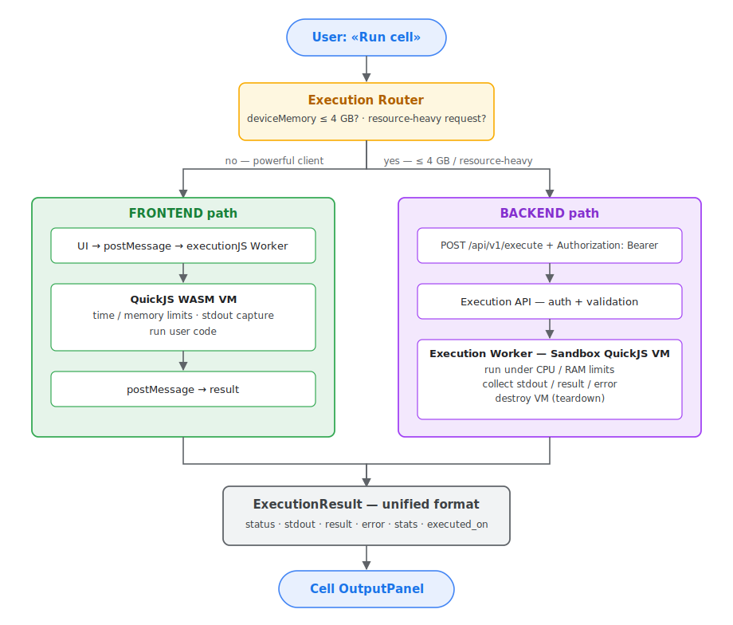

# Execution Architecture — JS Notebook code execution model

> An architecture decision for executing notebook cell code. Resolves the
> **Tech Lead — Execution Architecture Decision** task (issue #69).

---

## 1. Overview — hybrid execution model

Notebook cell code runs under a **hybrid model** with two paths and routing
between them:

| Path | Where it runs | When it is chosen |
|---|---|---|
| **Frontend WASM** | QuickJS (WebAssembly) in the browser | **MVP** — fast local run (current sprint) |
| **Backend remote** | QuickJS sandbox on the server | **Target (future) path** — client RAM ≤ 4 GB **or** a resource-heavy request |

Both paths return the result in a **unified format** (`ExecutionResult`,
section 9) — the UI and the contract do not depend on where the code ran.

> **Current sprint scope.** The MVP is **the Frontend WASM path only**. The
> backend remote path (`POST /execute`) is the **target (future)
> architecture** and is not part of this sprint's core scope: per the sprint
> plan `/execute` is a stretch goal, delivered as a separate task in
> coordination with issue #73 (API for Execution + Notebooks). This document
> describes the full target model so that the frontend MVP is designed from
> the start to be extensible toward the backend path.

**Why a hybrid:**

- **Frontend WASM** gives an instant response with no network round-trip and
  does not load the server; most notebook runs are lightweight.
- **The backend** is needed when the browser runtime is unstable or
  insufficient: weak clients (a guideline — **≤ 4 GB RAM**) and
  heavy/long-running computations.
- **A single runtime.** Both paths use QuickJS, so code behaves identically
  regardless of where it runs.

---

## 2. Related engineering tasks

The document builds on previously created engineering tasks and is aligned
with them:

| Issue | Role | Relation to this document |
|---|---|---|
| #69 | Tech Lead — Execution Architecture Decision | This document is the result of this task |
| #70 | Engineer #1 — JS Execution Engine (MVP) | Execution engine — both paths (sections 4–5) |
| #71 | Engineer #2 — Notebook Execution UX | The UI calls the execution layer; «Run cell» (section 6) |
| #73 | Engineer #4 — API for Execution + Notebooks | Backend contract `POST /execute` (sections 5, 10) |
| #75 | Engineer — Authorization | Backend execution and the API require authentication (section 8) |
| #63 | Frontend Sandbox Execution via QuickJS | Frontend WASM path (sections 4, 7) |

---

## 3. High-level diagram

```
┌──────────────────────────────────────────────┐      ┌────────────────────────────┐
│                FRONTEND (SPA)                │      │          BACKEND           │
│                                              │      │                            │
│  Notebook UI (Monaco)                        │      │  ┌──────────────────────┐  │
│  ┌────────────────────┐                      │      │  │  Auth Service        │  │
│  │ CodeCell + «Run»    │                     │      │  │  (JWT / OTP)         │  │
│  └─────────┬──────────┘                      │      │  └──────────────────────┘  │
│            │                                 │      │  ┌──────────────────────┐  │
│  ┌─────────▼──────────┐                      │ RPC  │  │  Execution API       │  │
│  │ Execution Router    │──────────────────────┼─────▶│  │  POST /api/v1/execute│  │
│  │ route choice        │   backend path       │ HTTP │  └──────────┬───────────┘  │
│  └────┬───────────────┘                      │  WS  │             │ RPC          │
│       │ frontend path                        │      │  ┌──────────▼───────────┐  │
│  ┌────▼───────────────┐                      │      │  │ Execution Worker     │  │
│  │ executionJS Worker  │                     │      │  │  ┌────────────────┐  │  │
│  │ QuickJS (WASM)      │                     │      │  │  │ Sandbox        │  │  │
│  │ ↕ postMessage       │                     │      │  │  │ QuickJS VM     │  │  │
│  └────┬───────────────┘                      │      │  │  │ CPU/RAM limits │  │  │
│       │                                       │      │  │  └────────────────┘  │  │
│  ┌────▼───────────────┐                      │      │  └──────────────────────┘  │
│  │ OutputPanel         │◀── ExecutionResult ──┼──────│                            │
│  └────────────────────┘   (unified format)   │      │                            │
└──────────────────────────────────────────────┘      └────────────────────────────┘
```

---

## 4. WebAssembly (WASM) runtime

The primary execution runtime is **QuickJS compiled to WebAssembly**.

- **Library:** `sebastianwessel/quickjs` — "Execute JavaScript and
  TypeScript in a WebAssembly QuickJS Sandbox"
  (<https://github.com/sebastianwessel/quickjs>). On top of it,
  `quickjs-emscripten` is the WASM build of the engine.
- **Why QuickJS/WASM:**
  - full modern JavaScript; TypeScript — via type stripping;
  - WASM provides portable isolation: the same module runs both in the
    browser and on the server;
  - fast startup of a new VM context for every run;
  - no access to the host environment by default — everything is passed in
    explicitly.
- **Frontend.** The QuickJS WASM module is loaded into a **Web Worker** so
  execution does not block the UI thread. The worker is the "executionJS
  layer".
- **Backend.** The same QuickJS engine runs in a WASM environment on the
  server (inside the Execution Worker). A single engine → identical code
  behavior.

In both cases TypeScript is supported optionally — types are stripped before
execution.

---

## 5. Execution routing

Before a run, the **Execution Router** on the frontend chooses the path:

```
choose BACKEND if:
    navigator.deviceMemory ≤ 4              (client RAM ≤ 4 GB)
  OR the request is marked resource-heavy   (see below)
otherwise:
    choose FRONTEND WASM
```

### 5.1 The "weak client" signal

RAM is estimated via the browser API `navigator.deviceMemory` (an approximate
value in GB). If the API is unavailable, the client is conservatively treated
as weak and the backend is chosen.

### 5.2 The "resource-heavy request" signal

A request is considered resource-heavy by one of these rules:

- **Pre-run heuristic** — a large amount of code, an explicit cell marking by
  the user ("run on the server").
- **Adaptively** — if the previous frontend run of this cell hit the WASM
  memory/time limit, the retry automatically goes to the backend.

### 5.3 Transparency for the UI

The Execution Router makes the path decision; the UI, the request format and
the result format (`ExecutionResult`) do not depend on the chosen path. The
response carries an `executed_on: "frontend" | "backend"` field — for
diagnostics and indication only.

---

## 6. Execution flow diagram



The same diagram in text form (ASCII):

```
                    ┌────────────────────────────┐
                    │      User: «Run cell»      │
                    └──────────────┬─────────────┘
                                   │
                    ┌──────────────▼─────────────┐
                    │      Execution Router       │
                    │   deviceMemory ≤ 4 GB ?     │
                    │   resource-heavy request ?  │
                    └───────┬────────────┬────────┘
           no (light,       │            │   yes (≤ 4 GB or
           powerful client) │            │   resource-heavy)
                            ▼            ▼
           ┌────────────────────┐    ┌──────────────────────────────┐
           │   FRONTEND path    │    │   BACKEND path               │
           │                    │    │                              │
           │ UI → postMessage → │    │ POST /api/v1/execute         │
           │ executionJS Worker │    │   + Authorization: Bearer    │
           │                    │    │ ─────────────────────────▶   │
           │ QuickJS WASM VM:   │    │ Execution API: auth + valid. │
           │  - time/mem limits │    │ ─────────────────────────▶   │
           │  - capture stdout  │    │ Execution Worker:            │
           │  - run             │    │  create Sandbox QuickJS VM   │
           │                    │    │  run under CPU/RAM limits    │
           │ postMessage ◀──────│    │  collect stdout/result/error │
           │  result            │    │  destroy VM                  │
           │                    │    │ ◀───────────────────────     │
           └─────────┬──────────┘    └───────────────┬──────────────┘
                     │                               │
                     └───────────────┬───────────────┘
                                     ▼
                    ┌────────────────────────────────┐
                    │  ExecutionResult (unified fmt)  │
                    │  status / stdout / result /     │
                    │  error / stats / executed_on    │
                    └───────────────┬────────────────┘
                                    ▼
                    ┌────────────────────────────────┐
                    │       Cell OutputPanel          │
                    └────────────────────────────────┘
```

Execution stages (identical for both paths):

| Stage | What happens |
|---|---|
| **Route** | The Router chooses frontend / backend |
| **Prepare** | Create a new isolated QuickJS VM, inject a safe environment |
| **Run** | Execute the code under limits (time / memory / instructions) |
| **Collect** | Gather stdout, the result, errors, metrics |
| **Respond** | Build the `ExecutionResult` |
| **Teardown** | Destroy the VM; nothing survives a run |

A VM is created **fresh for every run** and destroyed afterwards. State is not
shared between cells by default (stateless execution).

---

## 7. Sandboxing approach

**Untrusted** user code is executed. The sandbox is built on QuickJS isolation
and follows the same principles for both paths.

### 7.1 Common principles

| Level | Protection |
|---|---|
| **VM** | A fresh QuickJS context per run; no host globals, no host `require`/`import` |
| **API surface** | Only explicitly passed-in functions are available (`console.*`). No `fetch`, filesystem, `process`, network or side-effecting timer APIs |
| **Resources** | A VM memory limit, an "instruction"/CPU-time limit, a wall-clock timeout |

### 7.2 Frontend WASM sandbox

- QuickJS-WASM runs in a **Web Worker** — a separate thread isolated from the
  DOM, `window`, `localStorage` and the page network.
- The worker has no DOM access; output reaches the UI only via `postMessage`.
- Memory/time limits are set at the QuickJS context level; on an overrun the
  worker aborts execution and may be recreated.

### 7.3 Backend sandbox

- QuickJS-WASM runs inside the **Execution Worker** — a separate
  process/container: cgroup limits, non-root, a read-only filesystem, no
  network.
- The Worker is deployed separately from the API; a VM compromise does not
  grant access to the database or secrets.

### 7.4 Default limits (configurable)

| Limit | Frontend | Backend |
|---|---|---|
| Wall-clock timeout | 5 s | 15 s |
| VM memory | 64 MB | 128 MB |
| Source code size | 256 KB | 256 KB |
| Output (stdout) size | 1 MB (truncated after) | 1 MB (truncated after) |

Exceeding a limit → execution is aborted, a structured error is returned
(section 9), the VM is destroyed. Hitting a limit on the frontend is the
typical trigger for adaptively switching to the backend (section 5.2).

---

## 8. Authorization

Backend execution and notebook operations require authentication. Implemented
in the backend `app/modules/auth` module (issue #75).

> **Target model — email + OTP (passwordless).** The source of truth for the
> auth contract is `api/docs/auth.md` and `ui/docs/auth.md`. Identification is
> by email and a one-time code (OTP); there is no login/password. The current
> `login`/`password` code is a temporary stub, to be replaced with the OTP
> flow under a separate ticket. The target model is described below.

### 8.1 Endpoints

| Method | Endpoint | Purpose |
|---|---|---|
| `POST` | `/api/v1/auth/otp/request` | Request a one-time code by email |
| `POST` | `/api/v1/auth/otp/verify` | Verify the OTP, issue a token pair |
| `POST` | `/api/v1/auth/refresh` | Rotate the refresh token, issue a new pair |
| `POST` | `/api/v1/auth/logout` | Revoke the refresh token (the session) |

There is no separate registration: a user is created **lazily** on the first
successful `otp/verify` for a new email.

### 8.2 OTP request

```
POST /api/v1/auth/otp/request
{ "email": "user@example.com" }
→ 204  prod — the code was sent by email
→ 200  dev  — { "otp": "123456" } the code is returned in the response
→ 422  invalid email
→ 429  OTP request rate limit exceeded
```

### 8.3 OTP verification

```
POST /api/v1/auth/otp/verify
{ "email": "user@example.com", "otp": "123456" }
→ 200 {
    "accessToken":  "<JWT>",
    "refreshToken": "<opaque>",
    "user":         { "id": "<uuid>", "email": "..." }
  }
→ 401  invalid or expired OTP
```

- **The OTP is one-time.** After a successful verification it is marked used
  and is no longer accepted.
- **Access token** — a JWT (`HS256`), stateless, TTL ~15 min; the payload
  carries `sub` = user id, `sessionId` = session id. Passed in the
  `Authorization: Bearer <token>` header.
- **Refresh token** — an opaque random string (not a JWT), TTL ~30 days. Only
  its hash (`sha256` / `argon2`) is stored in the database. On `refresh` the
  old token is marked `replaced` and a new one is issued (family rotation).
  `logout` marks the session `revoked`.

### 8.4 Endpoint protection

The `get_current_user` dependency extracts the Bearer token, validates the
JWT, and loads the user. An invalid/expired token → `401`. The backend
Execution API and the Notebooks API use this dependency. Frontend execution
needs no authentication (the code never leaves the browser), but saving
results and notebook syncing do.

### 8.5 Dev/local environment

In dev/local no emails are sent — the OTP code is returned directly in the
`otp/request` response (`200 { otp }`) and shown in the browser (see issue #75
and `api/docs/auth.md`). In production the OTP is delivered by email (`204`).

---

## 9. Error-handling strategy

Execution errors are **not** transport-level errors. For the backend path the
`POST /execute` request completes successfully (`200`), and the execution
status is conveyed in the response body; HTTP codes are reserved for problems
with the request itself. For the frontend path it is the same — an execution
error arrives as an ordinary `postMessage` message, not as a worker exception.

### 9.1 Error classes

| Class | Where it arises | `status` in ExecutionResult | Transport |
|---|---|---|---|
| `syntax_error` | Code parsing | `error` | 200 / message |
| `runtime_error` | An exception in user code | `error` | 200 / message |
| `timeout` | Wall-clock limit exceeded | `timeout` | 200 / message |
| `memory_limit` | VM memory limit exceeded | `resource_limit` | 200 / message |
| `output_limit` | stdout volume exceeded | `ok` (output truncated) + flag | 200 / message |
| `sandbox_error` | A sandbox infrastructure failure | `internal_error` | 200 / message |
| `unauthorized` | Missing/invalid token (backend path) | — | HTTP 401 |
| `validation_error` | A bad request (size, fields) | — | HTTP 422 |
| `rate_limited` | Concurrent-run limit exceeded (backend) | — | HTTP 429 |

### 9.2 ExecutionResult format

```json
{
  "status": "ok | error | timeout | resource_limit | internal_error",
  "executed_on": "frontend | backend",
  "stdout": "captured console.log ...",
  "result": "<serialized value of the last expression>",
  "error": {
    "type": "syntax_error | runtime_error | timeout | memory_limit | sandbox_error",
    "message": "ReferenceError: x is not defined",
    "line": 3,
    "column": 7,
    "stack": "<trace, trimmed to user code>"
  },
  "stats": { "duration_ms": 42, "memory_kb": 5120 }
}
```

When `status == "ok"` the `error` field is `null`. The trace is cleaned of
internal sandbox frames — the user sees only their own code.

### 9.3 Principles

- **Failure isolation.** A VM crash/timeout does not affect the UI (frontend)
  or the API process (backend); the VM is always destroyed in `teardown`.
- **Adaptive fallback.** A `timeout` / `memory_limit` on the frontend path is
  a signal for the Router to mark the request resource-heavy and retry it on
  the backend (section 5.2). The auto-retry decision is shown to the user.
- **Safe messages.** Error text contains no server paths, versions, or
  internal infrastructure details.
- **Logging.** `sandbox_error` / `internal_error` are logged structurally (on
  the backend — `structlog` with a correlation id); the user gets a generic
  message.
- **Determinism for the UI.** The UI relies on `status` and `error.type`,
  unified across both paths, rather than on parsing text.

---

## 10. Communication model

### 10.1 `postMessage` — UI ↔ executionJS Worker (frontend path)

Code runs in a Web Worker, so the channel between the UI thread and the
executionJS worker is **`postMessage`**:

```
UI ──postMessage({ type: "execute", code, language })──▶ executionJS Worker
UI ◀─postMessage({ type: "result", ExecutionResult })── executionJS Worker
UI ◀─postMessage({ type: "stdout", chunk })──────────── executionJS Worker
```

The worker is isolated from the DOM; the only way to deliver output to the UI
is `postMessage`. Messages are typed; the result payload is the shared
`ExecutionResult`.

### 10.2 RPC — Frontend ↔ Backend (backend path)

The channel to the server is **RPC over HTTP/WebSocket**:

- **REST (synchronous).** `POST /api/v1/execute` — request/response for short
  runs.
- **WebSocket (streaming).** For long runs: the backend sends `stdout`,
  `result`, `error`, `done` events as execution proceeds; the UI updates the
  OutputPanel incrementally.

The RPC contract is typed messages (`ExecuteRequest` → `ExecutionResult` / an
`ExecutionEvent` stream), described in the API OpenAPI schema (issue #73).

### 10.3 RPC — Backend ↔ Sandbox VM

Inside the backend the Execution Worker communicates with the QuickJS VM via
**message passing**: a `{ code, limits }` request is sent into the VM, and
responses (`stdout` chunks, the final result) arrive as messages. The channel
is a host↔WASM bridge / the IPC of the isolated process.

### 10.4 Summary

| Link | Mechanism |
|---|---|
| UI ↔ executionJS Worker (frontend) | `postMessage`, typed messages |
| Frontend ↔ Backend (backend path) | RPC: REST (`POST /execute`) + WebSocket for streaming |
| Backend ↔ Sandbox VM | message RPC over a host-WASM bridge / IPC |

On every channel the result payload is the single `ExecutionResult`, which
makes the frontend and backend paths interchangeable behind a shared
contract.

---

## 11. Open questions / next iterations

- **Routing fine-tuning.** Calibrating the "resource-heavy" threshold and the
  adaptive fallback policy against real metrics.
- **Shared cell context.** Execution is currently stateless. A shared context
  (variables across cells) would require a long-lived VM per notebook session
  — separately for the frontend and backend paths.
- **Backend queue and scaling.** As load grows, the Execution Worker is moved
  into a pool/queue with horizontal scaling.
- **npm package support.** Loading libraries into the sandbox is a separate
  security decision (whitelist, prebuild), shared by both paths.
